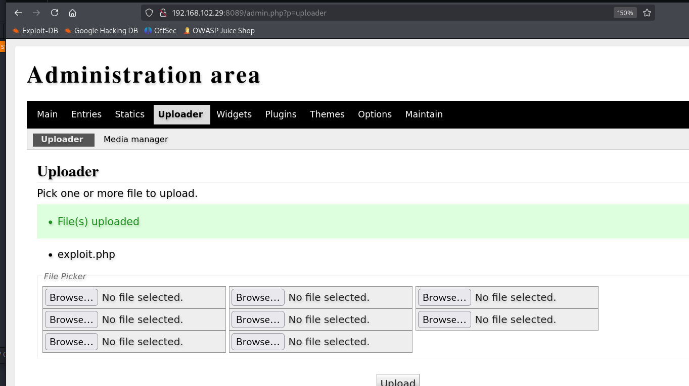

# ✔️ Cascade

## 建立立足点

### 信息枚举

* 使用Nmap对目标系统进行开放端口扫描：

```bash
nmap -sC -sV -p- -oA cascade 10.129.63.72 --open
```

<figure><figcaption></figcaption></figure>

<figure><figcaption></figcaption></figure>

* 先把域名写入host文件：

<figure><figcaption></figcaption></figure>

* 先尝试匿名登录，无收获：

```bash
smbclient -N -L 10.129.63.72
```

<figure><figcaption></figcaption></figure>

* 使用enum4linux枚举一下：

<figure><figcaption></figcaption></figure>

<figure><figcaption></figcaption></figure>

* 发现一些用户名和密码策略，用户名可以先收集起来：

<figure><figcaption></figcaption></figure>

<figure><figcaption></figcaption></figure>

* 找到了一些内置组信息和组成员关系：

<figure><figcaption></figcaption></figure>

* 还有本地组信息和组成员关系：

<figure><figcaption></figcaption></figure>

<figure><figcaption></figcaption></figure>

* 域组和域成员关系：

<figure><figcaption></figcaption></figure>


### GET SHELL


## 权限提升

### 本地信息收集


### ROOT



本例机器确实算中等难度，常规枚举后所得到的信息需要各种解码才能获取，在线的解码工具没什么用，从来没解出来过一次，解码命令行更好用。

(本例机器中途重置过，因此IP地址有变化，但其利用过程和结果不变)

