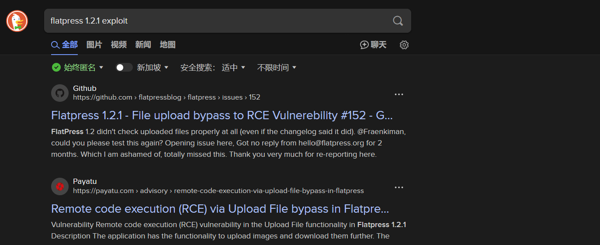

# ✔️ Resolute

## 建立立足点

### 信息收集

* 使用Nmap对目标系统进行开放端口扫描：

```bash
nmap -sC -sV -p- -oA resolute 10.129.176.63 --open
```

<figure><figcaption></figcaption></figure>

<figure><figcaption></figcaption></figure>

* Nmap扫描结果中已获得了目标域名：<mark style="color:red;">**megabank.local**</mark>&#x20;

<figure><figcaption></figcaption></figure>

<figure><figcaption></figcaption></figure>

* 因为没有任何Web页面的开放端口，所以直接进行针对SMB/RPC服务的一系列的匿名登录操作，看看是否可以找到些什么信息：

```bash
# 可以成功的匿名登录，但是没有任何信息返回：
smbclient -N -L 10.129.176.63
smbmap -H 10.129.176.63
nmap --script smb-vuln* -p 139,445 10.129.176.63
rpcclient 10.129.176.63
rpcclient -U '' 10.129.176.63
```

<figure><figcaption></figcaption></figure>

<figure><figcaption></figcaption></figure>

<figure><figcaption></figcaption></figure>

* 之前一直没啥大用的enum4linux这次表现不错，收集到了很多有用的信息，如目标上所有的用户名还有密码策略：

```bash
enum4linux 10.129.176.63
```

<figure><figcaption></figcaption></figure>

<figure><figcaption></figcaption></figure>


后面复盘时意识到，此处密码策略中的Account Lockout Threshold: None，这意味着可以是用密码暴破而不用担心账户被锁定，是否有意引导我进“兔子洞”？！因为本例中的所有凭证都无需暴破。


* 在enum4linux的输出结果中，就已经找到了一个有效凭证：<mark style="color:red;">**Marko Novak : Welcome123!**</mark>

<figure><figcaption></figcaption></figure>

* 将刚刚收集到的所有用户名全部整理成一份username.txt文件，待后续使用：

<figure><figcaption></figcaption></figure>


### GET SHELL


## 权限提升

### 本地信息收集


### ROOT



本例Get Shell阶段不难，常规的信息收集之后就能拿到。提权阶段涉及到了我的盲点，第一次遇到DNSadmins提权，查阅了一些提示和技术解析的文章后，成功root。

(本例机器中途重置过，因此IP地址有所改变，但不影响其利用过程和结果)



