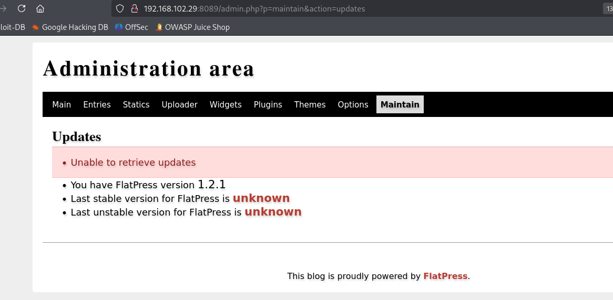

# ✔️ Support

## 建立立足点

### 信息收集

* 使用Nmap对目标开放端口进行扫描：

```bash
nmap -sC -sV -p- -oA support 10.129.230.181 --open
```

<figure><figcaption></figcaption></figure>

<figure><figcaption></figcaption></figure>

* 先进行SMB匿名登录测试，发现可以登录上去，且有感兴趣的共享文件/support-tools（这种和靶机名称一致的提示还是蛮明显的）：

```bash
smbclient -N -L 10.129.230.181
```

<figure><figcaption></figcaption></figure>

* 分别尝试把这些共享文件递归下载到本地，也发现只有/support-tools的可以下载，其他的都拒绝：

```bash
smbclient //10.129.230.181/support-tools
RECURSE ON
PROMPT OFF
mget *
```

<figure><figcaption></figcaption></figure>

<figure><figcaption></figcaption></figure>

<figure><figcaption></figcaption></figure>

* 下载到Kali本地后，查看发现都是exe文件和一个压缩包文件，名称是UserInfo，猜测可能包含用户信息：

<figure><figcaption></figcaption></figure>

* 解压UserInfo.exe.zip，比较感兴趣的有config文件和exe文件：

<figure><figcaption></figcaption></figure>

* config文件，有.NET框架的版本号信息，其他的好像没什么了：

<figure><figcaption></figcaption></figure>

* 没有预期的任何凭证之类的内容，用enum4linux枚举也无任何收获：

```bash
enum4linux 10.129.230.181
```

<figure><figcaption></figcaption></figure>

* smbmap也没有收获：

```bash
smbmap -H 10.129.230.181 -u "" -p ""
```

<figure><figcaption></figcaption></figure>

* 尝试RPC空密码连接被拒绝：

```bash
rpcclient 10.129.230.181
```

<figure><figcaption></figcaption></figure>

* 回到刚才解压出来的UserInfo.exe，查看其信息：

```bash
file UserInfo.exe
```

<figure><figcaption></figcaption></figure>

* 把这个exe文件放入Windows系统中运行试试，这里要把整个解压出来的所有文件都一起放进Windows中，不然会运行不成功：

<figure><figcaption></figcaption></figure>

<figure><figcaption></figcaption></figure>

<figure><figcaption></figcaption></figure>


### GET SHELL


## 权限提升

### 本地信息收集


### ROOT



本例虽然是被归类为简单机器，但是涉及到自己的盲区较多，看的提示较多完成度不高，对我来讲算难的机器。

