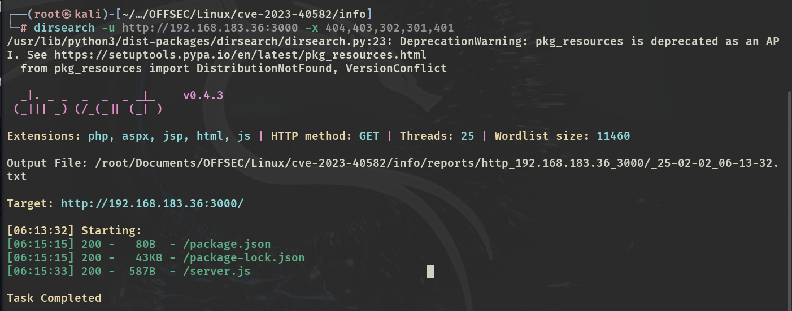

# ✔️ Greenhorn

## 建立立足点

### 信息收集

* 使用Nmap对目标进行开放端口扫描，获得3个开放端口：

```bash
nmap -sC -sV -p- -oA greenhorn 10.129.61.36 --open
```

<figure><figcaption></figcaption></figure>

* 将IP和域名添加到/etc/hosts文件后，开始检查80端口上的内容，发现了目标正在运行的软件pluck和admin登录的入口：

<figure><figcaption></figcaption></figure>

* 进入admin面板后发现了pluck的版本（4.7.18），随后尝试几个弱口令均失败：

<figure><figcaption></figcaption></figure>

<figure><figcaption></figcaption></figure>

*


### 漏洞查阅

* 在信息枚举阶段获取到的pluck 4.7.18确实是有一个远程代码执行的漏洞，但是在本例中的漏洞利用阶段仅起到了辅助作用，并未直接利用：

<figure><figcaption></figcaption></figure>

<figure><figcaption></figcaption></figure>

* 从该漏洞脚本中可以确认其上传文件的类型是zip类型，


### 漏洞利用


### GET SHELL


## 权限提升

### 本地信息收集


### 漏洞查阅&#x20;


### 漏洞利用


### ROOT



本例Get Shell阶段枚举、阅读源码和对各个上传点的尝试是重点，提权部分不算典型的OSCP机型，图像解析的部分更偏向于CTF。

(本例机器中途重置过，IP地址有改变，但不影响其利用过程和实现结果)

