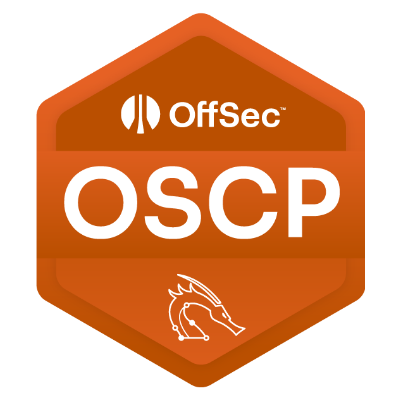

# 📝 MEMO.

 

## 备忘录.

> 保持简单 KEEP THINGS SIMPLE.

* [x] 创建自己的CheatSheet
* [x] 考试中不让使用各类商业版、大规模自动化、AI的工具
* [x] 深入理解各个技术原理和细节，以免在考试过程中浪费时间
* [x] 一定要重视编写报告（截图+说明），要步骤清晰详细、截图完整。要证明自己确实是理解了相关技术细节
* [x] 在渗透测试的各个环节中，遇到问题（卡壳）不要急，不要让情绪控制自己的大脑。先冷静下来，仔细读返回的错误信息，对各种依赖项进行查缺补漏，通常都能顺利解决
* [x] 时间管理：给每台机器设置一个完成的上限时间，到时间后无论完成与否，立刻换下一台
* [x] 警惕“兔子洞”！若发现某个漏洞很明显，但是始终利用不了，或是查找不到匹配的漏洞利用时，就该停下来看看自己是否掉进了“兔子洞”。有效的策略就是：**继续前进，继续查找其他的可利用漏洞，不要纠缠，不要纠缠，不要纠缠！！**
* [x] 端口转发很有用
* [x] 时刻保持向任何人学习，同时谨记：看，就少BB。
