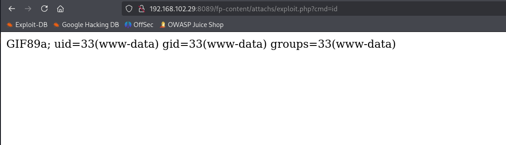

# ✔️ Return

## 建立立足点

### 信息收集

* 使用Nmap对目标系统进行开放端口扫描：

```bash
nmap -sC -sV -p- -oA return 10.129.95.241 --open
```

<figure><figcaption></figcaption></figure>

<figure><figcaption></figcaption></figure>

* 根据Nmap的输出信息发现目标系统开放了80端口，登录查看是一个打印机的管理员界面：

<figure><figcaption></figcaption></figure>

* 使用dirsearch没有找出来什么特别的隐藏文件/目录，在查看settings.php页面发现了域名、端口还有用户名和密码，其中密码部分无法查看：

<figure><figcaption></figcaption></figure>

<figure><figcaption></figcaption></figure>

<figure><figcaption></figcaption></figure>

* 将找到的域名和之前Nmap输出中的域名添加到hosts文件里：

<figure><figcaption></figcaption></figure>

* 先尝试使用不同工具进行匿名登录SMB均无收获，enum4linux信息收集也没有什么收获：

<figure><figcaption></figcaption></figure>

<figure><figcaption></figcaption></figure>

<figure><figcaption></figcaption></figure>

* 回到打印机settings的界面，它设置的端口389是LDAP协议，该打印机是通过LDAP连接到目标域进行身份验证的，这意味着用户svc-printer是一个域内用户账户，且LDAP是明文传输，因此当我们修改目标服务器地址为Kali本机地址时，并在本机做好监听后，即可读取到传输的明文密码内容：

<figure><figcaption></figcaption></figure>

* 此时已获得一个有效凭证：<mark style="color:red;">**svc-printer:1edFg43012!!**</mark>&#x20;

### GET SHELL

* 通常当有了一个有效凭证后就可以尝试用evil-winrm来获取shell了（虽然并不总是管用）：

```bash
evil-winrm -i return.local -u svc-printer -p '1edFg43012!!'
```

<figure><figcaption></figcaption></figure>

<figure><figcaption></figcaption></figure>

## 权限提升

### 本地信息收集

* 上传winPEAS进行信息收集：

```bash
# evil-winrm
upload /root/Documents/HTB-AD/return/info/winPEASx64.exe
.\winPEASx64.exe
```

<figure><figcaption></figcaption></figure>

*


### ROOT





