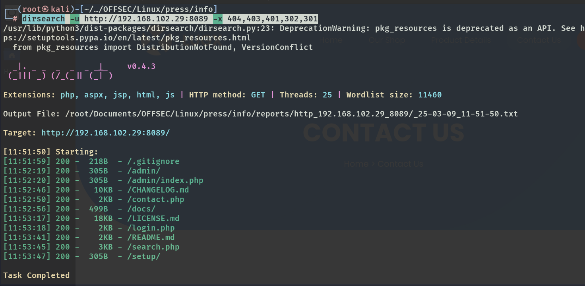

# ✔️ Sauna

## 建立立足点

* 使用Nmap对目标系统进行开放端口扫描：

```bash
nmap -sC -sV -p- -oA sauna 10.129.77.184 --open
```

<figure><figcaption></figcaption></figure>

* 发现开放目标系统开放了80端口，查看后并没有发现什么特别有用的信息，但是发现了很多用户名，先收集起来也许后续会有用：

<figure><figcaption></figcaption></figure>

<figure><figcaption></figcaption></figure>

<figure><figcaption></figcaption></figure>

* 对该80端口进行常规的隐藏文件/目录扫描，没什么收获：

```bash
gobuster dir -u http://10.129.77.184/ -w /usr/share/wordlists/dirb/common.txt
```

<figure><figcaption></figcaption></figure>

* dirsearch也没有什么收获：

<figure><figcaption></figcaption></figure>

* 使用多个工具尝试无密码登录SMB服务，倒是成功了，但是还是无收获：

```bash
smbclient -N -L 10.129.77.184
```

<figure><figcaption></figcaption></figure>

```bash
crackmapexec smb 10.129.77.184
```

<figure><figcaption></figcaption></figure>

* 使用ldapsearch针对目标的LDAP目录树进行遍历的域名查询，获取到：**DC=EGOTISTICAL-BANK,DC=LOCAL**

```bash
ldapsearch -x -H LDAP://10.129.95.180 -s base namingcontexts
```

<figure><figcaption></figcaption></figure>

* 再次进行递归查询，发现有用信息：**dn: CN=Hugo Smith,DC=EGOTISTICAL-BANK,DC=LOCAL**

```bash
ldapsearch -x -H LDAP://10.129.95.180 -b 'DC=EGOTISTICAL-BANK,DC=LOCAL' -s sub 
```

* 将收集到的所有用户名及其改写的变体制作成一个username.txt文件：

<figure><figcaption></figcaption></figure>

* 因为已经收集到一些专门针对目标系统的有效用户名，所以可以尝试使用kerbrute进行一下暴破，找到几个用户名：

```
./kerbrute_linux_amd64 userenum -d EGOTISTICAL-BANK.LOCAL username.txt --dc 10.129.95.180
```

<figure><figcaption></figcaption></figure>

*


## 权限提升



本例机器中途重置后IP有变化，但其利用过程无影响。

