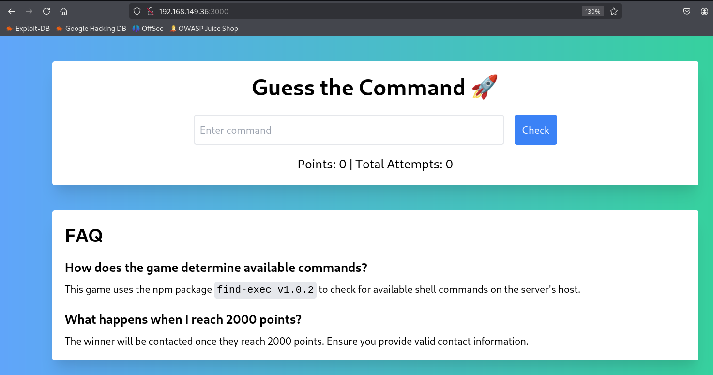

# ✔️ Search

## 建立立足点

## 信息收集

* 使用Nmap针对目标进行开放端口扫描，发现如下端口：

```bash
nmap -sC -sV -p- -oA search 10.129.65.154 --open
```

<figure><figcaption></figcaption></figure>

<figure><figcaption></figcaption></figure>

* 目标开放了80 端口，使用gobuster扫描隐藏目录/文件：

```bash
gobuster dir -u http://10.129.65.154/ -w /usr/share/wordlists/dirb/common.txt
```

<figure><figcaption></figcaption></figure>

* 有几个目录值得关注一下：/staff、/certenroll、/certsrv、/images，分别尝试后都是拒绝访问：

<figure><figcaption></figcaption></figure>

<figure><figcaption></figcaption></figure>

<figure><figcaption></figcaption></figure>

* 在/certsrv页面发现登录框，尝试几个弱口令后均失败，暂时放下：

<figure><figcaption></figcaption></figure>

* 初步查看网页，找到一些用户名，可以先收集起来，后续也许有用：

<figure><figcaption></figcaption></figure>

* 使用smbcclient可以匿名登录，但是没有收获：

```bash
smbclient -N -L 10.129.65.154
```

<figure><figcaption></figcaption></figure>

* 尝试使用其他工具进行匿名登录SMB服务，均无收获：

<figure><figcaption></figcaption></figure>

* 使用enum4linux枚举所有可收集到的内容，没找到什么特别有用的，获取到了域名和域SID：

```bash
enum4linux 10.129.65.154
```

<figure><figcaption></figcaption></figure>

<figure><figcaption></figcaption></figure>

*


### GET SHELL


## 权限提升

### 本地信息收集


### ROOT



本例机器中途重置过，因此IP地址有所变化，不影响利用过程及其结果。

