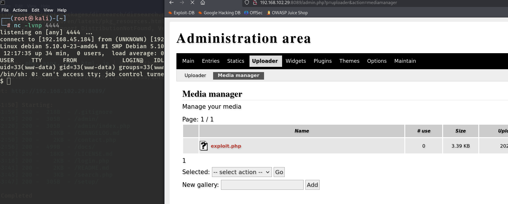

# ✔️ Keeper

## 建立立足点

### 信息收集

* 使用Nmap对目标系统的开放端口进行扫描：

```bash
nmap -sC -sV -p- -oA keeper 10.129.8.148 --open
```

<figure><figcaption></figcaption></figure>

* 在扫描的同时可尝试查看目标的80端口上是否有内容，发现有一个链接，指向域名tickets.keeper.htb，将其添加到hosts文件里：

<figure><figcaption></figcaption></figure>

* 再次点击链接，会跳转到[http://tickets.keeper.htb/rt/](http://tickets.keeper.htb/rt/)，一个登录界面：

<figure><figcaption></figcaption></figure>

* 该界面底部有当前正在运行的服务及其版本号：RT 4.4.4，尝试了几个弱口令均失败，但是在搜索相关漏洞时，发现了RT 4.4.4的文档文件中的关于安全提示的信息里，包含了该应用的默认凭证信息：<mark style="color:red;">**root : password**</mark>

<figure><figcaption></figcaption></figure>

<figure><figcaption></figcaption></figure>

* 尝试利用该凭证登录成功：

<figure><figcaption></figcaption></figure>

* 在检查RT系统中的各项内容时，在Admin——Users中发现可两个用户账户信息界面，**root**和**lnorgaard**，并且找到了用户lnorgaard的明文密码：<mark style="color:red;">**Welcome2023!**</mark>

<figure><figcaption></figcaption></figure>

<figure><figcaption></figcaption></figure>

<figure><figcaption></figcaption></figure>

<figure><figcaption></figcaption></figure>

### GET SHELL

* 因为当前已经有两个有效凭证了，根据Nmap的扫描结果来看，还有一个运行着SSH服务的22号端口，可以分别用这两个有效凭证尝试登录：

```bash
# 密码：Welcome2023!
ssh lnorgaard@10.129.8.148
```

<figure><figcaption></figcaption></figure>

<figure><figcaption></figcaption></figure>

## 权限提升

### 本地信息收集

* 在之前检查RT时发现Admin——Tools——System Configuration里面有一些目标系统信息，手动枚举也没有什么收获：

<figure><figcaption></figcaption></figure>

<figure><figcaption></figcaption></figure>

<figure><figcaption></figcaption></figure>

* 上传linpeas.sh进行信息收集：

<figure><figcaption></figcaption></figure>

* 从linpeas的输出信息中发现，以下文件目录是与root用户账户相关联的，可能包含敏感信息，但是缺被放在了低权限用户的/home目录中：

<figure><figcaption></figcaption></figure>

* 依次检查后，把RT30000.zip下载到本地，解压缩后进一步查看：

<figure><figcaption></figcaption></figure>


### 漏洞利用


### ROOT



Get Shell阶段只需要简单的枚举即可获得shell。

(本例机器中途重置过，IP地址有变化，但不影响漏洞利用及其实现结果)

