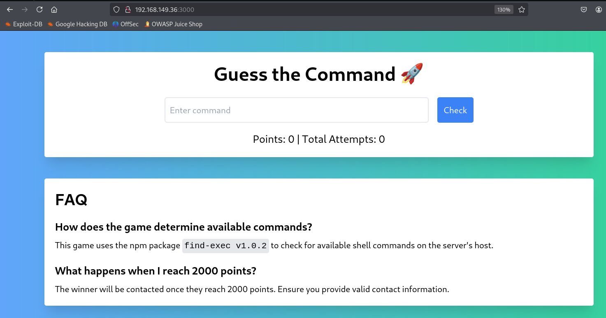

# ✔️ Law

## 建立立足点

### 信息收集

* 使用Nmap对目标系统的开放端口进行扫描：

```bash
nmap -sC -sV -p- -oA law 192.168.210.190 --open
```

<figure><figcaption></figcaption></figure>

* 检查80端口上的内容，发现正在运行的服务及其版本号为：htmlawed 1.2.5

<figure><figcaption></figcaption></figure>

### 漏洞查阅

* 搜索htmlawed 1.2.5相关已知公开漏洞，发现一个远程命令执行漏洞：

<figure><figcaption></figcaption></figure>

* 得知htmlawed 1.2.5版本存在着CVE-2022-35914的漏洞，该漏洞


### 漏洞利用


### GET SHELL


## 权限提升

### 本地信息收集


### 漏洞利用


### ROOT





