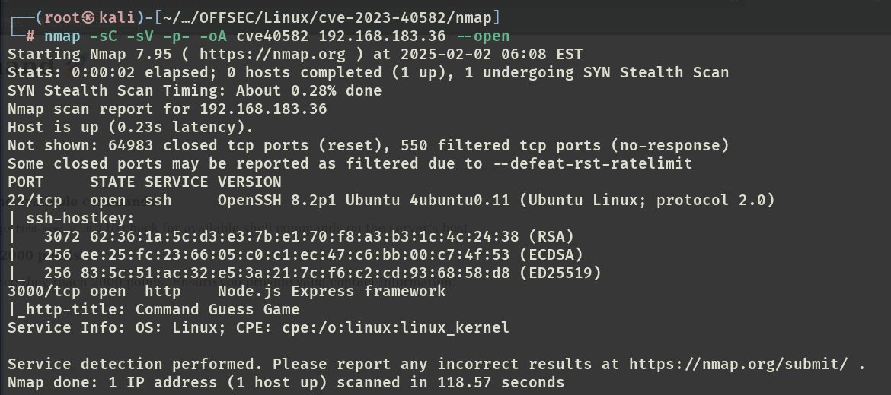

# ✔️ Bullybox

## 建立立足点

### 信息收集

* 使用Nmap对目标系统的开放端口进行扫描，获取到2个开放端口：22和80

```bash
nmap -sC -sV -p- -oA bullybox 192.168.149.27 --open
```

<figure><figcaption></figcaption></figure>

* 将域名添加到hosts文件中：

```bash
echo "192.168.149.27   bullybox.local" | tee -a /etc/hosts
```

* 检查/robots.txt文件，发现一些隐藏目录，依次查看没有任何收获：

<figure><figcaption></figcaption></figure>

* 在80端口的登录界面进行注册：

```
- test@test.com
- fiii : Test123456
```


* 登录后并没有任何发现，只得知当前系统使用的是boxbilling程序：


* 枚举80端口上的隐藏文件/目录，这里发现一些/.git目录：

```bash
gobuster dir -u http://bullybox.local -w /usr/share/seclists/Discovery/Web-Content/common.txt
```


* 使用git-dumper提取目标网站的git中的内容：

```bash
git-dumper http://bullybox.local/.git .
```


* 在提取出来的文件中，**bb-config.php**中发现管理员凭证：

```
- **admin ：Playing-Unstylish7-Provided**
- admin@bullybox.local
```


* 使用该有效凭证进入admin的管理界面后，获取到当前运行的软件BoxBilling及其版本号：**BoxBilling 4.22.1.5**


### 漏洞查阅


### 漏洞利用


## 权限提升

### ROOT

* 直接切换至root用户：

```bash
sudo su
```


