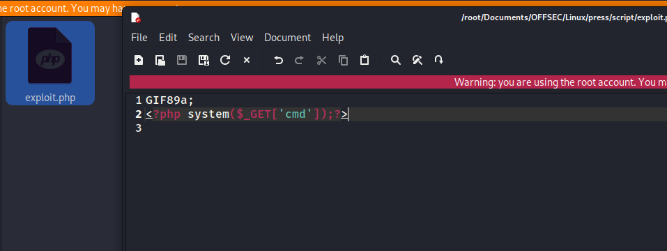
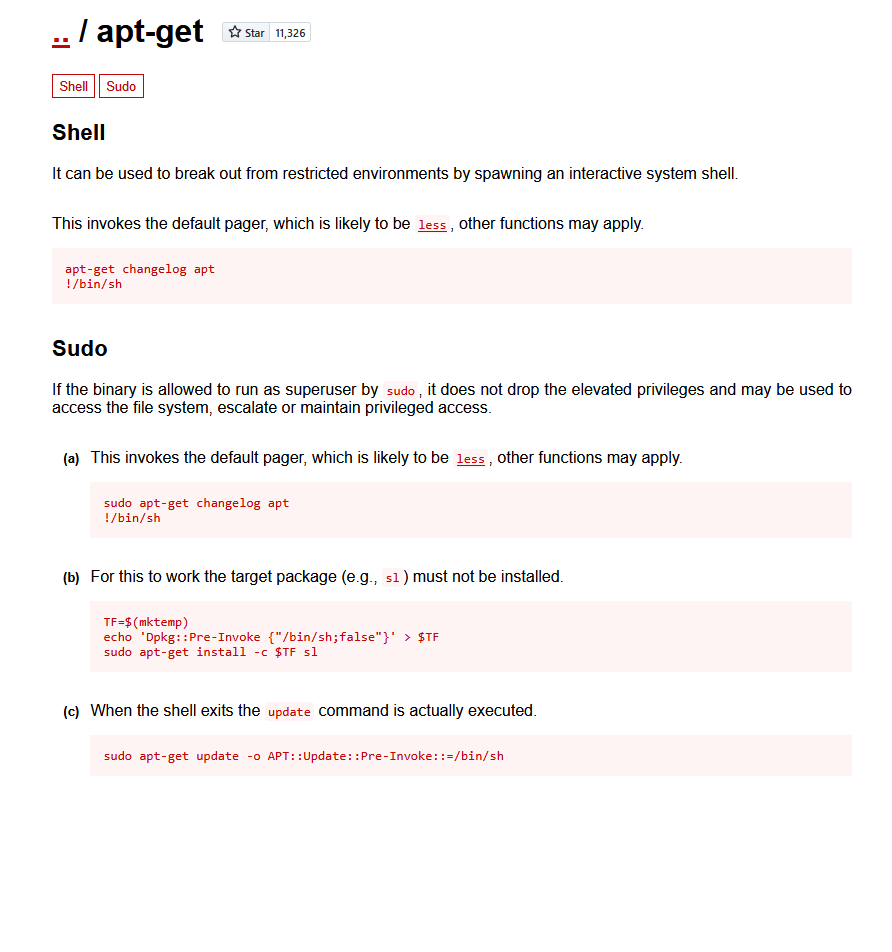

# ✔️ Press

## 建立立足点

### 信息收集

* 使用Nmap对目标系统的开放端口进行扫描，获取到3个开放端口：22 / 80 / 8089

```bash
nmap -sC -sV -p- -oA press 192.168.102.29 --open
```

<figure><figcaption></figcaption></figure>

* 检查80端口上的内容，没什么收获：

<figure><figcaption></figcaption></figure>

* 枚举80端口上的隐藏文件/目录，依次查看没什么收获：

```bash
dirsearch -u http://192.168.102.29 -x 404,403,401,302,301
```

<figure><figcaption></figcaption></figure>

* 检查8089端口上的内容，尝试弱口令**admin:password**登录成功：

<figure><figcaption></figcaption></figure>

<figure><figcaption></figcaption></figure>

* 枚举8089端口上的隐藏文件/目录：

```bash
dirsearch -u http://192.168.102.29:8089 -x 404,403,401,302,301
```

<figure><figcaption></figcaption></figure>

* 在8089端口的多处发现正在运行的程序及其版本号：**FlatPress version 1.2.1**

<figure><figcaption></figcaption></figure>

<figure><figcaption></figcaption></figure>

### 漏洞查阅

* 查找FlatPress version 1.2.1相关公开已知漏洞，发现了文件上传 + 远程代码执行的漏洞：

<figure><figcaption></figcaption></figure>

#### PoC：

* 编写一个一句话木马的PHP文件，在其头部添加`GIF89a;`：

<figure><figcaption></figcaption></figure>

* 在目标系统的Uploader处上传该exploit.py脚本：

<figure><figcaption></figcaption></figure>

<figure><figcaption></figcaption></figure>

* 然后访问该脚本路径并执行命令，返回了当前账户和权限信息，还能成功返回/etc/passwd中的内容，因此证明了当前目标系统存在文件上传和远程代码执行的漏洞：

<figure><figcaption></figcaption></figure>

<figure><figcaption></figcaption></figure>

<figure><figcaption></figcaption></figure>

### 漏洞利用

* 现在将exploit.py脚本中的一句话木马改为具有完全交互式反弹shell的PHP脚本内容：

<figure><figcaption></figcaption></figure>

### Get Shell

* Kali本机做好监听，上传该脚本即可获取到反弹shell：

<figure><figcaption></figcaption></figure>

## 权限提升

### 本地信息收集

* 简单手动枚举，发现可以不用密码就能执行有root权限的程序：apt-get

```bash
sudo -l
```

<figure><figcaption></figcaption></figure>

### 漏洞利用

* 在GTFOBins中发现apt-get的可利用Payload进行提权：

```bash
sudo /usr/bin/apt-get update -o APT::Update::Pre-Invoke::=/bin/sh
```

<figure><figcaption></figcaption></figure>

### ROOT

* 利用成功后获取到root账户权限：

<figure><figcaption></figcaption></figure>

* 获取到proof.txt文件内容：

<figure><figcaption></figcaption></figure>
